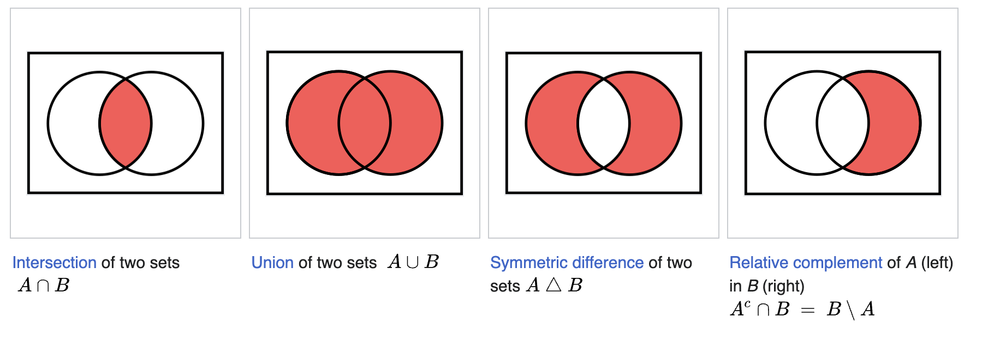

# Combining 3D solids
<!-- toc -->

We've seen how to make a lot of different solids. You could transform a 2D shape into a 3D solid. From there, you can copy and transform that 3D solid by rotating, translating or rotating it. Now it's time to learn a third way to build 3D solids: by combining other 3D solids. This is sometimes called _constructive solid geometry_ and it's a very powerful tool for any serious mechanical engineering work.

## Constructive solid geometry

Remember in school, when you learned about Venn diagrams? How you can take the _union_, the _intersection_ or the _difference_ of two shapes? If you need a quick recap, here's a screenshot from [Wikipedia's article on set operations].



We can perform similar operations on 3D solids in KCL. They're sometimes called "3D booleans", because they perform the standard boolean set operations, but on 3D bodies. They're also known as "constructive solid geometry" operations (CSG) because they let you take existing solid geometory, and construct new geometries from them.

Let's see how these operations work. Here's two cubes.

```kcl=two_cubes
@settings(defaultLengthUnit = mm, kclVersion = 2.0)

// Sketch a square
sketch001 = sketch(on = XY) {
  // Sketch a rectangle first.
  line1 = line(start = [var -2.21mm, var -5.39mm], end = [var 2.8mm, var -5.39mm])
  line2 = line(start = [var 2.8mm, var -5.39mm], end = [var 2.8mm, var -0.39mm])
  line3 = line(start = [var 2.8mm, var -0.39mm], end = [var -2.21mm, var -0.39mm])
  line4 = line(start = [var -2.21mm, var -0.39mm], end = [var -2.21mm, var -5.39mm])
  coincident([line1.end, line2.start])
  coincident([line2.end, line3.start])
  coincident([line3.end, line4.start])
  coincident([line4.end, line1.start])
  parallel([line2, line4])
  parallel([line3, line1])
  perpendicular([line1, line2])
  horizontal(line3)

  // Make all sides the same length (i.e. make the rectangles square).
  distance([line1.start, line1.end]) == 5
  equalLength([line1, line2, line3, line4])
}

region001 = region(segments = [sketch001.line1, sketch001.line2])
cubeGreen = extrude(region001, length = 5)
  |> appearance(color = "#229922")

cubeBlue = clone(cubeGreen)
  |> translate(x = 3, z = 2, y = 1)
  |> appearance(color = "#222299")
```

<!-- KCL: name=two_cubes,alt=One green and one blue cube-->

That's what it looks like _before_ we apply any CSG operations. Now let's see what happens when we use KCL's [`union`], [`intersect`] and [`subtract`] functions on these. Firstly, let's do a union. This should create a new solid which combines both input solids. 

```kcl=two_cubes_union
@settings(defaultLengthUnit = mm, kclVersion = 2.0)

// This part is unchanged from previous examples.
sketch001 = sketch(on = XY) {
  line1 = line(start = [var -2.21mm, var -5.39mm], end = [var 2.8mm, var -5.39mm])
  line2 = line(start = [var 2.8mm, var -5.39mm], end = [var 2.8mm, var -0.39mm])
  line3 = line(start = [var 2.8mm, var -0.39mm], end = [var -2.21mm, var -0.39mm])
  line4 = line(start = [var -2.21mm, var -0.39mm], end = [var -2.21mm, var -5.39mm])
  coincident([line1.end, line2.start])
  coincident([line2.end, line3.start])
  coincident([line3.end, line4.start])
  coincident([line4.end, line1.start])
  parallel([line2, line4])
  parallel([line3, line1])
  perpendicular([line1, line2])
  horizontal(line3)
  distance([line1.start, line1.end]) == 5
  equalLength([line1, line2, line3, line4])
}

region001 = region(segments = [sketch001.line1, sketch001.line2])
cubeGreen = extrude(region001, length = 5)
  |> appearance(color = "#229922")
cubeBlue = clone(cubeGreen)
  |> translate(x = 3, z = 2, y = 1)
  |> appearance(color = "#222299")

// Apply a CSG operation.
both = union([cubeGreen, cubeBlue])
```

<!-- KCL: name=two_cubes_union,alt=Two gray cubes just like the previous picture-->

This [`union`] of our two cubes has the exact same dimensions and position as the two cubes, but they've been combined into one solid body. The resulting solid inherits the green appearance of the first body in the union (if you swapped the order to `[cubeBlue, cubeGreen]` instead, the final solid would be blue).

What's the point of doing this? Now we can use transforms like `appearance` or `rotate` on the single unified solid. Previously we needed to transform each part separately, which can get annoying. Now that it's a single body, transformations will apply to the whole thing -- both the first cube's volume, and the second cube's.

**Note**: Instead of writing `union([cubeGreen, cubeBlue])` you can use the shorthand `cubeGreen + cubeBlue` or `cubeGreen | cubeBlue`. This is a nice little shorthand you can use if you want to.

Let's try an intersection. This combines both cubes, but leaves only the volume from where they overlapped.


```kcl=two_cubes_intersection
@settings(defaultLengthUnit = mm, kclVersion = 2.0)

// This part is unchanged from previous examples.
sketch001 = sketch(on = XY) {
  line1 = line(start = [var -2.21mm, var -5.39mm], end = [var 2.8mm, var -5.39mm])
  line2 = line(start = [var 2.8mm, var -5.39mm], end = [var 2.8mm, var -0.39mm])
  line3 = line(start = [var 2.8mm, var -0.39mm], end = [var -2.21mm, var -0.39mm])
  line4 = line(start = [var -2.21mm, var -0.39mm], end = [var -2.21mm, var -5.39mm])
  coincident([line1.end, line2.start])
  coincident([line2.end, line3.start])
  coincident([line3.end, line4.start])
  coincident([line4.end, line1.start])
  parallel([line2, line4])
  parallel([line3, line1])
  perpendicular([line1, line2])
  horizontal(line3)
  distance([line1.start, line1.end]) == 5
  equalLength([line1, line2, line3, line4])
}

region001 = region(segments = [sketch001.line1, sketch001.line2])
cubeGreen = extrude(region001, length = 5)
  |> appearance(color = "#229922")
cubeBlue = clone(cubeGreen)
  |> translate(x = 3, z = 2, y = 1)
  |> appearance(color = "#222299")

// Apply a CSG operation.
both = intersect([cubeGreen, cubeBlue])
```

<!-- KCL: name=two_cubes_intersection,alt=Intersection of the two cubes-->

This keeps only the small cube shape from where the previous two intersected. This is a new solid, so it can be transformed just like any other solid. 

**Note**: Instead of writing `intersect([cubeGreen, cubeBlue])` you can use the shorthand `cubeGreen & cubeBlue`. This is a nice little shorthand you can use if you want to.

Lastly, let's try a [`subtract`] call:

```kcl=two_cubes_subtraction
@settings(defaultLengthUnit = mm, kclVersion = 2.0)

// This part is unchanged from previous examples.
sketch001 = sketch(on = XY) {
  line1 = line(start = [var -2.21mm, var -5.39mm], end = [var 2.8mm, var -5.39mm])
  line2 = line(start = [var 2.8mm, var -5.39mm], end = [var 2.8mm, var -0.39mm])
  line3 = line(start = [var 2.8mm, var -0.39mm], end = [var -2.21mm, var -0.39mm])
  line4 = line(start = [var -2.21mm, var -0.39mm], end = [var -2.21mm, var -5.39mm])
  coincident([line1.end, line2.start])
  coincident([line2.end, line3.start])
  coincident([line3.end, line4.start])
  coincident([line4.end, line1.start])
  parallel([line2, line4])
  parallel([line3, line1])
  perpendicular([line1, line2])
  horizontal(line3)
  distance([line1.start, line1.end]) == 5
  equalLength([line1, line2, line3, line4])
}

region001 = region(segments = [sketch001.line1, sketch001.line2])
cubeGreen = extrude(region001, length = 5)
  |> appearance(color = "#229922")
cubeBlue = clone(cubeGreen)
  |> translate(x = 3, z = 2, y = 1)
  |> appearance(color = "#222299")

// Apply a CSG operation.
both = subtract(cubeGreen, tools = [cubeBlue])
```

<!-- KCL: name=two_cubes_subtraction,alt=Green cube with blue cube subtracted-->

Note that the syntax for [`subtract`] is a little different. The first argument is the solid (or solids) which will have some volume carved out. The second argument is a list of solids to cut out. You can think of these as "tools" -- you're basically passing tools of various shapes which can carve out special volumes.

Let's try a subtraction with multiple tools:

```kcl=two_cubes_subtraction_multi_tool
@settings(defaultLengthUnit = mm, kclVersion = 2.0)

// This part is unchanged from previous examples.
sketch001 = sketch(on = XY) {
  line1 = line(start = [var -2.21mm, var -5.39mm], end = [var 2.8mm, var -5.39mm])
  line2 = line(start = [var 2.8mm, var -5.39mm], end = [var 2.8mm, var -0.39mm])
  line3 = line(start = [var 2.8mm, var -0.39mm], end = [var -2.21mm, var -0.39mm])
  line4 = line(start = [var -2.21mm, var -0.39mm], end = [var -2.21mm, var -5.39mm])
  coincident([line1.end, line2.start])
  coincident([line2.end, line3.start])
  coincident([line3.end, line4.start])
  coincident([line4.end, line1.start])
  parallel([line2, line4])
  parallel([line3, line1])
  perpendicular([line1, line2])
  horizontal(line3)
  distance([line1.start, line1.end]) == 5
  equalLength([line1, line2, line3, line4])
}

region001 = region(segments = [sketch001.line1, sketch001.line2])
cubeGreen = extrude(region001, length = 5)
  |> appearance(color = "#229922")
cubeBlue = clone(cubeGreen)
  |> translate(x = 3, z = 2, y = 1)
  |> appearance(color = "#222299")


// Add another blue cube.
cubeBlue2 = clone(cubeBlue)
  |> translate(x = -6)

// Cut both blue cubes out of the green cube.
both = subtract(cubeGreen, tools = [cubeBlue, cubeBlue2])
```

<!-- KCL: name=two_cubes_subtraction_multi_tool,alt=Green cube with blue cube subtracted-->

And one with multiple targets. We'll make two green cubes (our target), and a blue cube (our tool). Then we'll subtract the blue cube from both green cubes:

```kcl=two_cubes_sub_multi_target
@settings(defaultLengthUnit = mm, kclVersion = 2.0)

// Sketch a square
sketch001 = sketch(on = XY) {
  // Sketch a rectangle first.
  line1 = line(start = [var -2.21mm, var -5.39mm], end = [var 2.8mm, var -5.39mm])
  line2 = line(start = [var 2.8mm, var -5.39mm], end = [var 2.8mm, var -0.39mm])
  line3 = line(start = [var 2.8mm, var -0.39mm], end = [var -2.21mm, var -0.39mm])
  line4 = line(start = [var -2.21mm, var -0.39mm], end = [var -2.21mm, var -5.39mm])
  coincident([line1.end, line2.start])
  coincident([line2.end, line3.start])
  coincident([line3.end, line4.start])
  coincident([line4.end, line1.start])
  parallel([line2, line4])
  parallel([line3, line1])
  perpendicular([line1, line2])
  horizontal(line3)

  // Make all sides the same length (i.e. make the rectangles square).
  distance([line1.start, line1.end]) == 5
  equalLength([line1, line2, line3, line4])
}
region001 = region(segments = [sketch001.line1, sketch001.line2])

// Target 1
cubeGreen = extrude(region001, length = 5)
  |> appearance(color = "#229922")

// Target 2
cubeGreen2 = clone(cubeGreen)
  |> translate(x = 6, y = 2)

// Tool
cubeBlue = clone(cubeGreen)
  |> translate(x = 3, z = 2, y = 1)
  |> appearance(color = "#222299")

// Do the subtraction
both = subtract([cubeGreen, cubeGreen2], tools = [cubeBlue])
```

<!-- KCL: name=two_cubes_sub_multi_target,alt=Green cube with blue cube subtracted-->

Lastly, we can do a subtraction with multiple tools, and multiple targets. We'll make two green cubes (targets) and two blue (the tools):

```kcl=subtract_multi_multi
@settings(defaultLengthUnit = mm, kclVersion = 2.0)

// Sketch a square
sketch001 = sketch(on = XY) {
  // Sketch a rectangle first.
  line1 = line(start = [var -2.21mm, var -5.39mm], end = [var 2.8mm, var -5.39mm])
  line2 = line(start = [var 2.8mm, var -5.39mm], end = [var 2.8mm, var -0.39mm])
  line3 = line(start = [var 2.8mm, var -0.39mm], end = [var -2.21mm, var -0.39mm])
  line4 = line(start = [var -2.21mm, var -0.39mm], end = [var -2.21mm, var -5.39mm])
  coincident([line1.end, line2.start])
  coincident([line2.end, line3.start])
  coincident([line3.end, line4.start])
  coincident([line4.end, line1.start])
  parallel([line2, line4])
  parallel([line3, line1])
  perpendicular([line1, line2])
  horizontal(line3)

  // Make all sides the same length (i.e. make the rectangles square).
  distance([line1.start, line1.end]) == 5
  equalLength([line1, line2, line3, line4])
}
region001 = region(segments = [sketch001.line1, sketch001.line2])

// Make two green cubes and two blue cubes.
cubeGreen = extrude(region001, length = 5)
  |> appearance(color = "#229922")

cubeGreen2 = clone(cubeGreen)
  |> translate(x = 6, y = 2)

cubeBlue = clone(cubeGreen)
  |> translate(x = 3, z = 2, y = 1)
  |> appearance(color = "#222299")

cubeBlue2 = clone(cubeBlue)
  |> translate(x = -1, y = -4, z = -1)
  |> rotate(yaw = 40deg)

// Subtract both blue from both green.
both = subtract([cubeGreen, cubeGreen2], tools = [cubeBlue, cubeBlue2])
```

<!-- KCL: name=subtract_multi_multi,alt=Green cube with blue cube subtracted-->

## Advanced options

There's a few arguments you can set for these functions. To be honest, you probably won't ever need to set these manually, but they're documented here just in case.

 - `tolerance` is a measure of how accurate the underlying 3D combination algorithms are. A tolerance of `0.1` means the algorithm is very inaccurate, but very fast. A tolerance of `0.000000001` makes the algorithm much more accurate, but slower. This is set to a sensible default, but you might need to change it for models with very precise, very small features.
 - `legacyMethod` lets you opt back into an older version of Zoo's geometry engine which used a different algorithm for CSG. We don't recommend setting this, and it will be removed at some point in the future.

[Wikipedia's article on set operations]: https://en.wikipedia.org/wiki/Set_(mathematics)#Basic_operations
[`intersect`]: https://zoo.dev/docs/kcl-std/functions/std-solid-intersect
[`subtract`]: https://zoo.dev/docs/kcl-std/functions/std-solid-subtract
[`union`]: https://zoo.dev/docs/kcl-std/functions/std-solid-union
