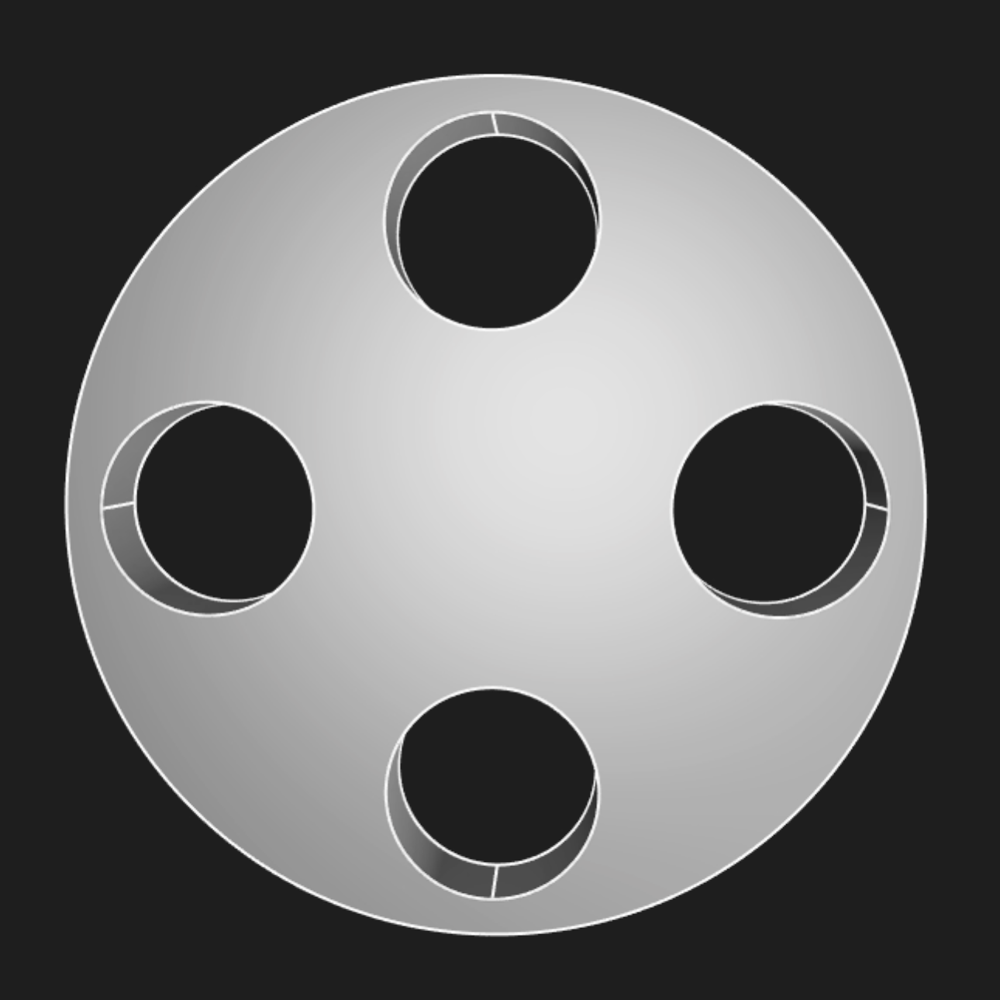
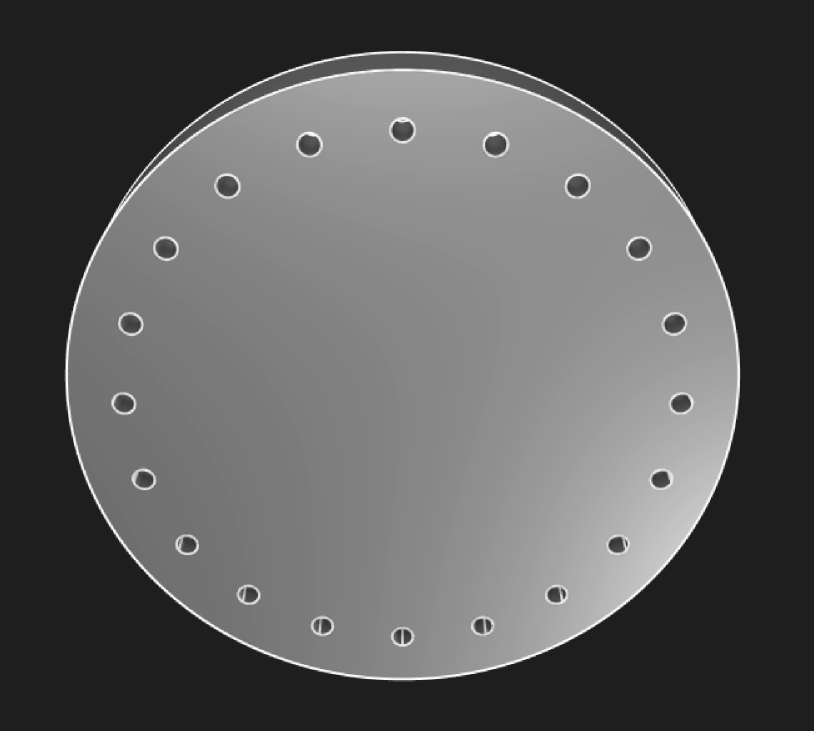

# Functions and parametric design
<!-- toc -->

In mechanical engineering, _parametric design_ is a key tool that helps you avoid redundant work when you're designing the same object over and over again with slight tweaks. In software engineering, _functions_ are a key tool that help you avoid redundant work when you're designing the same software over and over again with slight tweaks.

That's right -- breaking a mechanical engineering project into several key parametric designs is basically the same as breaking a software engineering project into several key functions. KCL makes parametric design easy and convenient with functions. You'll declare functions to represent parametric designs, and you'll call those functions with specific arguments to produce specific designs with the right parameters. Let's see how.

## Function declaration

We briefly looked at function declarations when we covered pattern transforms. Let's write an example function declaration and analyze its parts.

```kcl
fn add(a, b) {
  sum = a + b
  return sum
}
```

A function declaration has a few key parts. Let's look at each one, in the order they appear:

 - The `fn` keyword
 - The function's  _name_ 
 - Round parentheses `(` and `)`
 - Within those parentheses, a list of argument names
 - Curly brackets `{` and `}`
 - Within those brackets, KCL code, which may end with a `return` statement.

This function takes two arguments, `a` and `b`, adds them, and returns their sum as the function's output. When a function executes the `return` statement, it evaluates the expression after `return`, stops executing, and outputs that value. You can call our example function like this:

```kcl
sum = add(a = 1, b = 2)
```

Functions can also declare one *unlabeled* arg. If you do want to declare an unlabeled arg, it must be the first arg declared. When declaring an unlabeled arg, prefix it with `@`, like here:

```kcl
// The @ indicates an argument can be used without a label.
// Note that only the first argument can use @.
fn increment(@x) {
  return x + 1
}

fn add(@x, delta) {
  return x + delta
}

two = increment(1)
three = add(1, delta = 2)
```

## Mechanical engineering with functions

Let's use functions to build a parametric pipe flange. We can start with a specific design, with specific direct measurements. Then we'll learn how to parameterize it. Then we can easily make a lot of similar pipe flanges with different parameters.

Here's a specific model. It's got 8 unthreaded holes, each with a radius of 4, and the overall model has a radius of 60. It's 10mm thick.

```kcl=specific_flange
@settings(defaultLengthUnit = mm, kclVersion = 2.0)

// Sketch a big circle.
bigCircleSketch = sketch(on = XZ) {
  circle1 = circle(start = [var 0mm, var 10mm], center = [var 0mm, var 0mm])
  coincident([circle1.center, ORIGIN])
  vertical([circle1.center, circle1.start])
  distance([circle1.start, circle1.center]) == 60
}

// Extrude it into a "base".
bigCircle = region(segments = [bigCircleSketch.circle1])
thickness = 10mm
base = extrude(bigCircle, length = thickness, symmetric = true)

// Start sketching a smaller circle
smallCircleSketch = sketch(on = XZ) {
  circle1 = circle(start = [var -0.83mm, var 8.27mm], center = [var 0mm, var 7.79mm])
  vertical([circle1.center, ORIGIN])
  vertical([circle1.center, circle1.start])
  distance([circle1.start, circle1.center]) == 4
}

// Extrude that circle into a small cylinder,
// then pattern it around, making little pegs.
pegs = region(segments = [smallCircleSketch.circle1])
  |> extrude(length = thickness * 3, symmetric = true)
  |> translate(x = 50)
  |> patternCircular3d(instances = 8, axis = Y, useOriginal = true)

// Remove the pegs from the base.
baseWithHoles = subtract(base, tools = pegs)
```

<!-- KCL: name=specific_flange,alt=The pipe flange-->

Its specific measurements, like number of holes, radius, thickness etc were chosen somewhat arbitrarily. What if we want to make another pipe flange in the future, with different measurements? We can turn this specific flange model into a parametric design by making it into a function. We'll define a function `flange` which takes in several parameters. Let's see:

```kcl=parametric_flange
@settings(defaultLengthUnit = mm, kclVersion = 2.0)

// Define a parametric flange
fn flange(numHoles, holeRadius, baseRadius, thickness, holeEdgeGap) {
  // Sketch a big circle.
  bigCircleSketch = sketch(on = XZ) {
    circle1 = circle(start = [var 0mm, var 10mm], center = [var 0mm, var 0mm])
    coincident([circle1.center, ORIGIN])
    vertical([circle1.center, circle1.start])
    distance([circle1.start, circle1.center]) == baseRadius
  }

  // Extrude it into a "base".
  bigCircle = region(segments = [bigCircleSketch.circle1])
  base = extrude(bigCircle, length = thickness, symmetric = true)

  // Start sketching a smaller circle
  smallCircleSketch = sketch(on = XZ) {
    circle1 = circle(start = [var -0.83mm, var 8.27mm], center = [var 0mm, var 7.79mm])
    vertical([circle1.center, ORIGIN])
    vertical([circle1.center, circle1.start])
    distance([circle1.start, circle1.center]) == holeRadius
  }

  // Extrude that circle into a small cylinder,
  // then pattern it around, making little pegs.
  pegs = region(segments = [smallCircleSketch.circle1])
    |> extrude(length = thickness * 3, symmetric = true)
    |> translate(x = baseRadius - holeEdgeGap)
    |> patternCircular3d(instances = numHoles, axis = Y, useOriginal = true)

  // Remove the pegs from the base.
  return subtract(base, tools = pegs)
}

// Call our parametric flange function, passing in specific parameter values, to make a specific flange.
originalFlangeAgain = flange(
  numHoles = 8,
  holeRadius = 5,
  baseRadius = 60,
  thickness = 10,
  holeEdgeGap = 10,
)
```

First we defined a function for making a parametric flange. This lets us make many possible flanges. First, we made our original flange again. But we can also make a range of other flanges, by varying the parameters! Here's one:

```kcl
flange(
  numHoles = 4,
  holeRadius = 15,
  baseRadius = 60,
  thickness = 20,
  holeEdgeGap = 20,
)
```



And let's try one more:

```kcl
flange(
  numHoles = 20,
  holeRadius = 3,
  baseRadius = 90,
  thickness = 20,
  holeEdgeGap = 15,
)
```



Replacing specific KCL code for a specific design with a parametric function gives you the flexibility to generate a lot of very similar designs, varying their parameters by passing in different arguments to suit whatever your project's requirements are.

## Repeating geometry with functions

Functions can also be used to avoid writing the same code over and over again, in a single model. Sketch blocks can be quite long, because each constraint is typically on its own line, and complex models have a lot of constraints. Even just drawing a simple cube takes 16 lines of code: 4 to create lines, 4 to join those lines together via `coincident` constraints, and then 8 more to make the quadrilateral into a square of the chosen side length.

If we wanted to make 3 cubes, we shouldn't copy and paste this code 3 times. That would be annoying to read. We could use the `clone()` function to copy the cube, and then use transform functions like `translate()` or `appearance()` to tweak the cube. But we could also make a reusable `cube` helper function, like this.

```kcl=two_cubes_purple_blue
@settings(defaultLengthUnit = mm, kclVersion = 2.0)

/// Helper function to make a 3D cube with the given length and position along X.
fn cube(sideLen, offset) {
  sketch001 = sketch(on = XY) {
    line1 = line(start = [var 0mm, var 0mm], end = [var 3.08mm, var 0mm])
    line2 = line(start = [var 3.08mm, var 0mm], end = [var 3.08mm, var -3.01mm])
    line3 = line(start = [var 3.08mm, var -3.01mm], end = [var 0mm, var -3.01mm])
    line4 = line(start = [var 0mm, var -3.01mm], end = [var 0mm, var 0mm])
    coincident([line1.end, line2.start])
    coincident([line2.end, line3.start])
    coincident([line3.end, line4.start])
    coincident([line4.end, line1.start])
    parallel([line2, line4])
    parallel([line3, line1])
    perpendicular([line1, line2])
    horizontal(line3)
    coincident([line1.start, ORIGIN])
    equalLength([line1, line2, line3, line4])
    fixed([line1.start, ORIGIN])
    distance([line1.start, line1.end]) == sideLen
  }
  hide(sketch001)
  return region(segments = [sketch001.line1, sketch001.line2])
    |> extrude(length = sideLen)
    |> translate(x = offset)
}

// Make two cubes, first one:
cube(sideLen = 2, offset = 2)
  |> appearance(color = "#26b8ba", metalness = 70, roughness = 40)

// And the second one:
cube(sideLen = 1, offset = 5)
  |> appearance(color = "#d205e1", metalness = 70, roughness = 40)
```

<!-- KCL: name=two_cubes_purple_blue,alt=Two cubes created with the same cube function call.-->

This is neater than copying and pasting the code to make 2 separate cubes, and it lets us have more control over the cube than using `clone()` and `translate()`. If we wanted to, say, tweak the height of each cube, we could add a new parameter `height` to our `cube` function. Or we could just alter the extrude length in the function body.

By putting the details of "what does a cube look like" in a single function, we make our code both more readable, and easier to change in the future.

**Note**: Currently, Zoo Design Studio doesn't support using point-and-click UI to change geometry created in functions. That's something we hope to support in the future.
