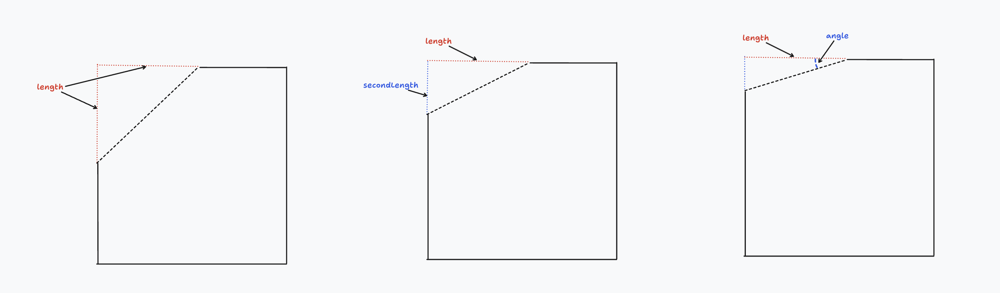

# Fillets, Chamfers and Edges

<!-- toc -->

## Motivation: Applying a fillet

When you manufacture a part, you often want to smooth off its sharp edges, so they're rounded and won't accidentally cut someone who holds it.
Let's say we're modeling a cube, like this:

```kcl=cube_no_fillets
// Sketch a square
width = 1
square = sketch(on = XY) {
  line1 = line(start = [width / 2, -width / 2], end = [width / 2, width / 2])
  line2 = line(start = [width / 2, width / 2], end = [-width / 2, width / 2])
  line3 = line(start = [-width / 2, width / 2], end = [-width / 2, -width / 2])
  line4 = line(start = [-width / 2, -width / 2], end = [width / 2, -width / 2])
}

// Extrude a cube.
regionCube = region(point = [0.4975mm, 0mm], sketch = square)
extrudeCube = extrude(regionCube, length = width)
```

It produces a cube like this:

<!-- KCL: name=cube_no_fillets,alt=A cube -->

What if we want to fillet one of its sides? Let's start simple and refer to one of the four bottom edges. Those edges were made by the four [`line`] function calls, which were all assigned to variables (`line1`, `line2`, etc). When we extruded the square into a cube, the variables were copied into the solid, under `.sketch.tags`. So we can reference the edge created from `line1` via `.sketch.tags.line1`, and apply a fillet to it.

```kcl=cube_one_fillet
// Sketch a square
width = 1
square = sketch(on = XY) {
  line1 = line(start = [width / 2, -width / 2], end = [width / 2, width / 2])
  line2 = line(start = [width / 2, width / 2], end = [-width / 2, width / 2])
  line3 = line(start = [-width / 2, width / 2], end = [-width / 2, -width / 2])
  line4 = line(start = [-width / 2, -width / 2], end = [width / 2, -width / 2])
}

// Extrude a cube.
regionCube = region(point = [0.4975mm, 0mm], sketch = square)
extrudeCube = extrude(regionCube, length = width)

// Fillet one edge
filletCube = fillet(extrudeCube, tags = extrudeCube.sketch.tags.line1, radius = 0.2)
```

The [`fillet`] function accepts an argument `tags`, which expects edges to fillet. You can pass in a single edge, like we did, or an array of edges like `[extrudeCube.sketch.tags.line1, extrudeCube.sketch.tags.line2]`.

That program should produce a cube with one filleted edge, like this:

<!-- KCL: name=cube_one_fillet,alt=A cube with one filleted edge -->

Nice! We could fillet all four bottom sides if we wanted to:

```kcl=cube_four_fillets
// Sketch a square
width = 1
square = sketch(on = XY) {
  line1 = line(start = [width / 2, -width / 2], end = [width / 2, width / 2])
  line2 = line(start = [width / 2, width / 2], end = [-width / 2, width / 2])
  line3 = line(start = [-width / 2, width / 2], end = [-width / 2, -width / 2])
  line4 = line(start = [-width / 2, -width / 2], end = [width / 2, -width / 2])
}

// Extrude a cube.
regionCube = region(point = [0.4975mm, 0mm], sketch = square)
extrudeCube = extrude(regionCube, length = width)

// Fillet all bottom edges
filletCube = fillet(
  extrudeCube,
  tags = [
    extrudeCube.sketch.tags.line1,
    extrudeCube.sketch.tags.line2,
    extrudeCube.sketch.tags.line3,
    extrudeCube.sketch.tags.line4,
  ],
  radius = 0.2,
)
```

<!-- KCL: name=cube_four_fillets,alt=A cube with four filleted edges-->

## Relationships between edges

So far, we've assigned geometry (like a line) to a variable when we create it, and then use that variable to refer to it later (e.g. for fillets). What about edges we don't create directly, and therefore can't assign to a variable? For example, we've already filleted the four bottom edges, but how do we fillet the top four edges? We aren't creating them via [`line`] calls. They're created by the CAD engine in the [`extrude`] call. If we didn't explicitly create them with a sketch function, how do we store them in a variable? Here's the secret --- you don't. KCL has a few helpful functions to access edges that you didn't create directly. Because we can refer to the bottom edges, we can use helper functions like [`getOppositeEdge`] to reference the top edges, like this:


```kcl=cube_two_opposite_fillets
// This is all the same as previous examples.
width = 1
square = sketch(on = XY) {
  line1 = line(start = [width / 2, -width / 2], end = [width / 2, width / 2])
  line2 = line(start = [width / 2, width / 2], end = [-width / 2, width / 2])
  line3 = line(start = [-width / 2, width / 2], end = [-width / 2, -width / 2])
  line4 = line(start = [-width / 2, -width / 2], end = [width / 2, -width / 2])
}
regionCube = region(point = [0.4975mm, 0mm], sketch = square)
extrudeCube = extrude(regionCube, length = width)

// Note that here we're using `getOppositeEdge`.
filletCube = fillet(
  extrudeCube,
  tags = [
    // Fillet the bottom edge
    extrudeCube.sketch.tags.line1,
    // Fillet the top edge
    getOppositeEdge(extrudeCube.sketch.tags.line1)
  ],
  radius = 0.2,
)
```

<!-- KCL: name=cube_two_opposite_fillets,alt=Cube with one filleted edge on the bottom and the opposite top edge too-->

We can fillet all four bottom edges _and_ all four top edges by using [`getOppositeEdge`] on each:

```kcl=cube_eight_fillets
// Same as previous examples:
width = 1
square = sketch(on = XY) {
  line1 = line(start = [width / 2, -width / 2], end = [width / 2, width / 2])
  line2 = line(start = [width / 2, width / 2], end = [-width / 2, width / 2])
  line3 = line(start = [-width / 2, width / 2], end = [-width / 2, -width / 2])
  line4 = line(start = [-width / 2, -width / 2], end = [width / 2, -width / 2])
}
regionCube = region(point = [0.4975mm, 0mm], sketch = square)
extrudeCube = extrude(regionCube, length = width)

// Fillet edges
filletCube = fillet(
  extrudeCube,
  tags = [
    // Fillet the bottom four edges
    extrudeCube.sketch.tags.line1,
    extrudeCube.sketch.tags.line2,
    extrudeCube.sketch.tags.line3,
    extrudeCube.sketch.tags.line4,
    // Fillet the top four edges
    getOppositeEdge(extrudeCube.sketch.tags.line1),
    getOppositeEdge(extrudeCube.sketch.tags.line2),
    getOppositeEdge(extrudeCube.sketch.tags.line3),
    getOppositeEdge(extrudeCube.sketch.tags.line4)
  ],
  radius = 0.2,
)

```

<!-- KCL: name=cube_eight_fillets,alt=Cube with all top and bottom edge fillets-->

So, we've filleted the bottom horizontal edges, and the top horizontal edges. What about the side (vertical) edges, which connect the top and bottom face? We can use [`getNextAdjacentEdge`] and [`getPreviousAdjacentEdge`] to reference them:

```kcl=cube_next_prev_fillets
// Sketch a square
width = 1
square = sketch(on = XY) {
  line1 = line(start = [width / 2, -width / 2], end = [width / 2, width / 2])
  line2 = line(start = [width / 2, width / 2], end = [-width / 2, width / 2])
  line3 = line(start = [-width / 2, width / 2], end = [-width / 2, -width / 2])
  line4 = line(start = [-width / 2, -width / 2], end = [width / 2, -width / 2])
}

// Extrude a cube
regionCube = region(point = [0.4975mm, 0mm], sketch = square)
extrudeCube = extrude(regionCube, length = width)

// Fillet edges
filletCube = fillet(
  extrudeCube,
  tags = [
    // Bottom edge
    extrudeCube.sketch.tags.line1,
    // One side edge
    getNextAdjacentEdge(extrudeCube.sketch.tags.line1),
    // The other side edge
    getPreviousAdjacentEdge(extrudeCube.sketch.tags.line1),
  ],
  radius = 0.2,
)
```

<!-- KCL: name=cube_next_prev_fillets,alt=Cube with two side fillets and one bottom-->

Here, we filleted the bottom side, `line1` just like we did before. But we've also filleted the sides adjacent to it. One side is "before" line1, one side is "after" line1, in Zoo's internal tracking of edges. We can use a similar trick to fillet all four vertical side edges:


```kcl=cube_next_prev_fillets_all_sides
// Sketch a square
width = 1
square = sketch(on = XY) {
  line1 = line(start = [width / 2, -width / 2], end = [width / 2, width / 2])
  line2 = line(start = [width / 2, width / 2], end = [-width / 2, width / 2])
  line3 = line(start = [-width / 2, width / 2], end = [-width / 2, -width / 2])
  line4 = line(start = [-width / 2, -width / 2], end = [width / 2, -width / 2])
}

// Extrude a cube
regionCube = region(point = [0.4975mm, 0mm], sketch = square)
extrudeCube = extrude(regionCube, length = width)

// Fillet edges
filletCube = fillet(
  extrudeCube,
  tags = [
    getNextAdjacentEdge(extrudeCube.sketch.tags.line1),
    getPreviousAdjacentEdge(extrudeCube.sketch.tags.line1),
    getNextAdjacentEdge(extrudeCube.sketch.tags.line2),
    getPreviousAdjacentEdge(extrudeCube.sketch.tags.line3),
  ],
  radius = 0.2,
)
```

<!-- KCL: name=cube_next_prev_fillets_all_sides,alt=Cube with two side fillets and one bottom fillet-->

## Edges between faces

Sometimes `getNextAdjacentEdge` and similar functions are a bit tricky to use. It can be hard to look at a model and figure out which is the next, or previous, or opposite, edge. There's another way to refer to edges: which faces does this edge touch? For this we use the [`getCommonEdge`] function.

```kcl=cube_common_edge
// This is the same as previous examples
width = 1
square = sketch(on = XY) {
  line1 = line(start = [width / 2, -width / 2], end = [width / 2, width / 2])
  line2 = line(start = [width / 2, width / 2], end = [-width / 2, width / 2])
  line3 = line(start = [-width / 2, width / 2], end = [-width / 2, -width / 2])
  line4 = line(start = [-width / 2, -width / 2], end = [width / 2, -width / 2])
}
regionCube = region(point = [0.4975mm, 0mm], sketch = square)
extrudeCube = extrude(regionCube, length = width)

// Find the edge that borders the face from line1 and the face from line2.
edge = getCommonEdge(faces = [
  extrudeCube.sketch.tags.line1,
  extrudeCube.sketch.tags.line2
])

// Then fillet it.
fillet(extrudeCube, tags = edge, radius = 0.2)
```

[`getCommonEdge`] takes a list of faces, and returns the edge that is shared between them -- their _common_ edge. This is a pretty useful function, because usually it's easier to reference and name faces rather than edges.

Notice in this example that the list of `faces` looks like a list of edges. We're passing in `line1` and `line2`, which we used to reference edges in the above examples. That's because KCL recognizes that `extrude` creates a face out of each edge (imagine each edge being dragged upwards, to create a face).

There are other ways to refer to faces, but we'll see them later in this book.

## Chamfers

A [`chamfer`] is just like a fillet, except that fillets smooth away an edge to make it round, but chamfers just make a single cut across an edge. Here's an example of the difference. Compare this chamfered cube with the filleted cubes above:

```kcl=chamfered_cube
// Same as previous examples
width = 1
square = sketch(on = XY) {
  line1 = line(start = [width / 2, -width / 2], end = [width / 2, width / 2])
  line2 = line(start = [width / 2, width / 2], end = [-width / 2, width / 2])
  line3 = line(start = [-width / 2, width / 2], end = [-width / 2, -width / 2])
  line4 = line(start = [-width / 2, -width / 2], end = [width / 2, -width / 2])
}
regionCube = region(point = [0.4975mm, 0mm], sketch = square)
extrudeCube = extrude(regionCube, length = width)

// Apply a chamfer
chamferedCube = chamfer(extrudeCube, tags = [getOppositeEdge(extrudeCube.sketch.tags.line1)], length = 0.2)
```

<!-- KCL: name=chamfered_cube,alt=A chamfered cube-->

### Advanced chamfers

To define the chamfer, you only need to provide its `length`. But if you want more control of the chamfer angle, you can set the optional `secondLength` or `angle` parameters. Let's see how they work.

 Chamfering cuts away at two faces, creating a third face in between them. By default, the chamfer cuts away an even amount from both sides, creating a chamfered face at a 45 degree angle. The amount cut away from each face is the `length` parameter. But you can make a chamfer that cuts different amounts from each face, using the `secondLength` or `angle` parameters. This diagram shows the cross-section of a cube being chamfered:



Setting a second length which is much bigger or smaller than the first length means the chamfer will be "steep" -- the new face will be at a very sharp (or very obtuse) angle between the existing two faces. You can also set this angle explicitly, via the `angle` parameter. You can't use both `angle` and `secondLength` because they're essentially two different ways of setting the same property.

## Measuring geometry

So we've learned to use variables from sketch blocks to reference the lines we create, then use helper functions like [`getOppositeEdge`] to reference other geometry elsewhere in the model. But these variables aren't just used for altering edges. They provide a valuable way to query and measure your models. Let's see how.

Let's say you've got a solid triangle, like this:

```kcl
// Make a triangle
sketch001 = sketch(on = YZ) {
  line1 = line(start = [var 5.29mm, var -4.11mm], end = [var -4.31mm, var -4.11mm])
  line2 = line(start = [var -4.31mm, var -4.11mm], end = [var 0.49mm, var 5.14mm])
  coincident([line1.end, line2.start])
  line3 = line(start = [var 0.49mm, var 5.14mm], end = [var 5.29mm, var -4.11mm])
  coincident([line2.end, line3.start])
  coincident([line3.end, line1.start])
  equalLength([line2, line3])
  horizontal(line1)
}

// Extrude it
region001 = region(point = [0.49mm, -4.1075mm], sketch = sketch001)
extrude001 = extrude(region001, length = 1)
```

Let's ask a simple question. How long is each side of the triangle?

It sounds simple, but to actually calculate it, you'd have to break out a pencil and paper, then do some trigonometry. The problem is, the length doesn't appear anywhere in the `line` function call. The lines are defined by their start and end points, and the length is an implicit property of those. Defining lines as a start and end is helpful, but it means important properties, like length, can't be read from our source code.

However, tags give us a simple way to refer to each line, and then query them for properties like length with the [`segLen`] function. Let's update our program:

```kcl
// Make a triangle
sketch001 = sketch(on = YZ) {
  line1 = line(start = [var 5.29mm, var -4.11mm], end = [var -4.31mm, var -4.11mm])
  line2 = line(start = [var -4.31mm, var -4.11mm], end = [var 0.49mm, var 5.14mm])
  coincident([line1.end, line2.start])
  line3 = line(start = [var 0.49mm, var 5.14mm], end = [var 5.29mm, var -4.11mm])
  coincident([line2.end, line3.start])
  coincident([line3.end, line1.start])
  equalLength([line2, line3])
  horizontal(line1)
}
// Extrude it
region001 = region(point = [0.49mm, -4.1075mm], sketch = sketch001)
extrude001 = extrude(region001, length = 1)

// Measure its side lengths
side1Len = segLen(extrude001.sketch.tags.line1)
side2Len = segLen(extrude001.sketch.tags.line2)
side3Len = segLen(extrude001.sketch.tags.line3)
```

Now you can open up the Variables pane and look at the `side1Len`, `side2Len` and `side3Len` variables to find each side's length. That's pretty useful! And if you want to use those lengths elsewhere in your code, you can! You could start drawing lines where the end is `[side1Len, 0]` for example, or plug those lengths into other calculations. 

There are other helpers too, like [`segStart`] and [`segEnd`] to find a line's start and end, respectively. Take a look at the KCL [standard library docs] to find them all.

[`chamfer`]: https://zoo.dev/docs/kcl-std/functions/std-solid-chamfer
[`fillet`]: https://zoo.dev/docs/kcl-std/functions/std-solid-fillet
[`getNextAdjacentEdge`]: https://zoo.dev/docs/kcl-std/functions/std-sketch-getNextAdjacentEdge
[`getOppositeEdge`]: https://zoo.dev/docs/kcl-std/functions/std-sketch-getOppositeEdge
[`getPreviousAdjacentEdge`]:
  https://zoo.dev/docs/kcl-std/functions/std-sketch-getPreviousAdjacentEdge
[`segAng`]: https://zoo.dev/docs/kcl-std/functions/std-sketch-segAng
[`segEnd`]: https://zoo.dev/docs/kcl-std/functions/std-sketch-segEnd
[`segLen`]: https://zoo.dev/docs/kcl-std/functions/std-sketch-segLen
[`segStart`]: https://zoo.dev/docs/kcl-std/functions/std-sketch-segStart
[`line`]: https://zoo.dev/docs/kcl-std/functions/std-solver-line
[`extrude`]: https://zoo.dev/docs/kcl-std/functions/std-sketch-extrude
[`getCommonEdge`]: https://zoo.dev/docs/kcl-std/functions/std-sketch-getCommonEdge
[standard library docs]: <https://zoo.dev/docs/kcl-std>
