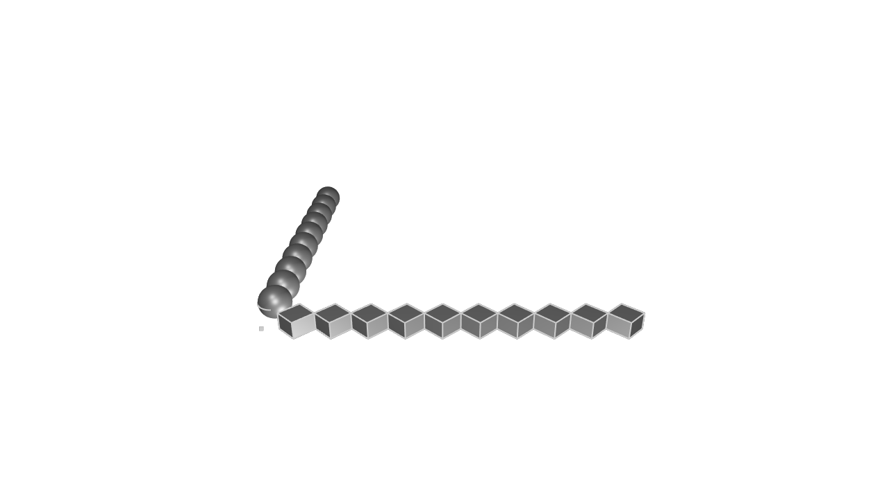

# Modules

<!-- toc -->

So far, all the KCL examples we've seen have been fairly small. But as you start modeling larger projects, you'll find that your code no longer neatly fits into one file. Organizing your code into smaller _modules_ can really help. In this chapter, we'll explain how to break your code into smaller _modules_, which let you break your one big KCL file into several smaller ones. This can help your models render much faster, by executing different modules in parallel.

## Splitting code into modules

So far, all our KCL examples have been a single file -- `main.kcl`. That's the default name that Zoo Design Studio and other KCL tools (like our command-line interface) use. But what happens when `main.kcl` gets too big? 

Say we have a KCL file like this, which defines a cube function, a sphere function, and then models several cubes and spheres.

```kcl=cubes_and_spheres
fn cube() {
  sideLength = 10
  return startSketchOn(XY)
    |> startProfile(at = [0, 0])
    |> polygon(numSides = 4, radius = sideLength, center = [0, 0])
    |> extrude(length = sideLength)
}

fn sphere() {
  radius = 10
  return startSketchOn(XY)
    |> startProfile(at = [0, 0])
    |> yLine(length = radius * 2)
    |> arc(angleStart = 90, angleEnd = 270, radius = radius)
    |> close()
    |> revolve(axis = Y)
}

// Draw ten spheres and ten cubes.
map([1..10], f = fn(@i) { return cube() |> translate( x = i * 20)})
map([1..10], f = fn(@i) { return sphere() |> translate(y = i * 20) })
```



We can split this file into two separate files, `cubes.kcl` and `spheres.kcl`. Here's `cubes.kcl`:

```kcl
fn cube() {
  sideLength = 10
  return startSketchOn(XY)
    |> startProfile(at = [0, 0])
    |> polygon(numSides = 4, radius = sideLength, center = [0, 0])
    |> extrude(length = sideLength)
}

map([1..10], f = fn(@i) { return cube() |> translate( x = i * 20)})
```

And here's `spheres.kcl`:

```kcl
fn sphere() {
  radius = 10
  return startSketchOn(XY)
    |> startProfile(at = [0, 0])
    |> yLine(length = radius * 2)
    |> arc(angleStart = 90, angleEnd = 270, radius = radius)
    |> close()
    |> revolve(axis = Y)
}

map([1..20], f = fn(@i) { return sphere() |> translate(y = i * 20) }
```

To tell `main.kcl` to execute these two files, we use the `import` keyword with each file's filepath.

```kcl
import "cubes.kcl"
import "spheres.kcl"
```

If you open this file, you'll see the same image as before (10 spheres and 10 cubes). But grouping related code into its own file can make it easier to read.

The other big change in our new code is that _each module executes in parallel_. This means the circles and spheres will be drawn simultaneously, instead of drawing all the cubes and then all the spheres. Splitting your big KCL files into smaller modules can therefore be really helpful for speeding up large models.

Each of your `.kcl` files is a KCL module. Files must all be in the same directory -- we don't currently support importing KCL modules from other directories. Import statements have to be at the top of a file -- they can't be nested within something like a function definition.

## Importing and exporting specific items

In the previous example, we just imported an entire file, causing KCL to run all its code. But what if I want to use values from one KCL file (perhaps a variable like `radius = 20in` or a function like `cube`) in another file? You can `export` and `import` specific variables between KCL modules. Let's see how.

Here's a simple example. Let's export some constants from one file (`car_constants.kcl`) and import them into another (`car_wheel.kcl`).

```kcl
// car_constants.kcl
export wheelDiameter = 15in
export wheelDepth = 4in
export axleLength = 2in
```

Here, we export 3 different variables from `car_constants.kcl`. Next, let's import and use some of them.

```kcl
// car_wheel.kcl
import wheelDepth, wheelDiameter from "car_constants.kcl"
startSketchOn(XY)
|> circle(radius = wheelDiameter / 2, center = [5, 5])
|> extrude(length = wheelDepth)
```

You can export any variable, not just simple numbers. For example, we could `export fn cube(@sideLength)` from `cube.kcl`, and then import it in `main.kcl` and use it to draw several cubes. Alternatively, `cube.kcl` could export an _actual cube_, not just a function to create one. Here's an example showing both of these:

```kcl
// cube.kcl
export fn cube(sideLength) {
  return startSketchOn(XY)
    |> startProfile(at = [0, 0])
    |> polygon(numSides = 4, radius = sideLength, center = [0, 0])
    |> extrude(length = sideLength)
}

export mySpecificCube = cube(sideLength = 20)
```

Now in `main.kcl` we can access `mySpecificCube`, and translate or rotate it. We can also use the `cube` function to make more cubes.

```
// main.kcl
import mySpecificCube, cube from "cube.kcl"

mySpecificCube |> translate(x = 50) |> rotate(pitch = 40)
secondCube = cube(sideLength = 7)
```


## Default export

Here's a little time-saving feature for KCL exports. The last expression or variable declared in a KCL module is its _default export_. This means we could shorten our program

```kcl
export fn cube(sideLength) {
  return startSketchOn(XY)
    |> startProfile(at = [0, 0])
    |> polygon(numSides = 4, radius = sideLength, center = [0, 0])
    |> extrude(length = sideLength)
}

// This is the last expression in the module, so it's the _default export_.
cube(sideLength = 20)
```

and use it in `main.kcl` like this:

```kcl
// main.kcl
import cube from "cube.kcl"
// Let's use the default export, and give it a name.
import "cube.kcl" as mySpecificCube

mySpecificCube |> translate(x = 50) |> rotate(pitch = 45)
secondCube = cube(sideLength = 7)
```

For more details, you can read the [modules reference] in the KCL docs.

[modules reference]: https://zoo.dev/docs/kcl-lang/modules
