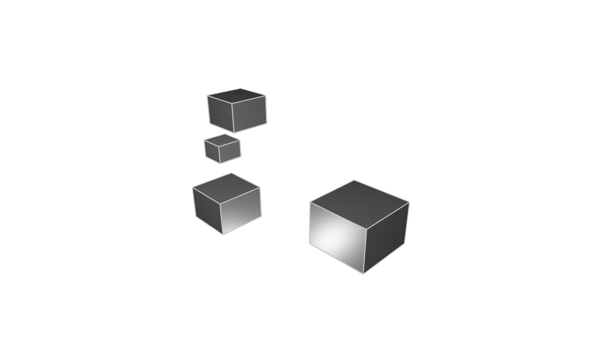

# Modules

<!-- toc -->

So far, all the KCL examples we've seen have been fairly small. But as you start modeling larger projects, you'll find that your code no longer neatly fits into one file. Organizing your code into smaller _modules_ can really help. In this chapter, we'll explain how to break your code into smaller _modules_, which let you break your one big KCL file into several smaller ones.

## Import and export

Say we have a KCL file like this, which defines a cube function, and then models several cubes using it.

```kcl=cube_pre_module
fn cube(sideLength) {
  return startSketchOn(XY)
    |> startProfile(at = [0, 0])
    |> polygon(numSides = 4, radius = sideLength, center = [0, 0])
    |> extrude(length = sideLength)
}

cube(sideLength = 10)
cube(sideLength = 5)
  |> translate(z = 20)
cube(sideLength = 10)
  |> translate(z = 20, y = 30)
cube(sideLength = 15)
  |> translate(z = -10, x = 40)
```



This file is small enough that we can read it and understand it, but you can imagine that if this model got really complicated -- say with fifty different cubes -- it would be helpful to separate out the logic from _modeling a cube in general_ from the logic which _places specific cubes throughout the scene_. We can give each of those concerns its own module. In `cube.kcl` we can define the `fn cube`, and then in `main.kcl` we can place our specific cubes wherever we want them.

Here's `cube.kcl`. We'll move our `fn cube` into it, and we have to add the keyword `export`.

```kcl=cube_lib_def
// cube.kcl
export fn cube(sideLength) {
  return startSketchOn(XY)
    |> startProfile(at = [0, 0])
    |> polygon(numSides = 4, radius = sideLength, center = [0, 0])
    |> extrude(length = sideLength)
}
```

That `export` keyword makes the function available for import in other files, like `main.kcl`:

```kcl
// main.kcl
import cube from "cube.kcl"

cube(sideLength = 10)
cube(sideLength = 5)
  |> translate(z = 20)
cube(sideLength = 10)
  |> translate(z = 20, y = 30)
cube(sideLength = 15)
  |> translate(z = -10, x = 40)
```

So, `cube.kcl` exports the `fn cube`. Then `main.kcl` _imports_ it from `cube.kcl`, then calls it. This way, the code for defining a cube can be broken into its own neat, reusable file. Nice!

Each of these files is a KCL module. Files must all be in the same directory -- we don't currently support importing KCL modules from other directories. Import statements have to be at the top of a file -- they can't be nested within something like a function definition.

A file can `export` many different functions, like this:

```kcl=many_exports
export fn cube(sideLength) {
  return startSketchOn(XY)
    |> startProfile(at = [0, 0])
    |> polygon(numSides = 4, radius = sideLength, center = [0, 0])
    |> extrude(length = sideLength)
}

export fn sphere(radius) {
  return startSketchOn(XY)
    |> startProfile(at = [0, 0])
    |> yLine(length = radius * 2)
    |> arc(angleStart = 90, angleEnd = 270, radius = radius)
}
```

Then `main.kcl` could import this as `import sphere, cube from "solids.kcl"`.
