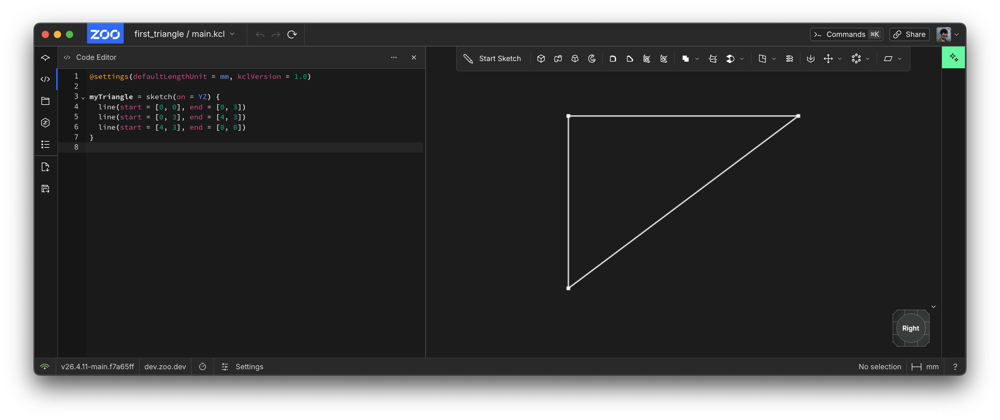
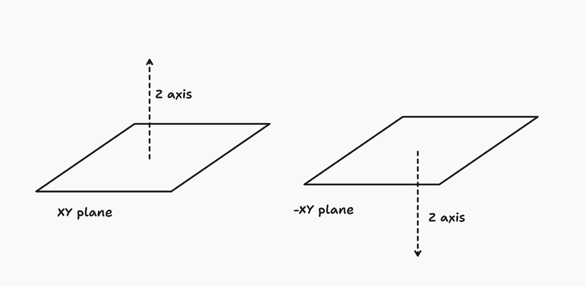
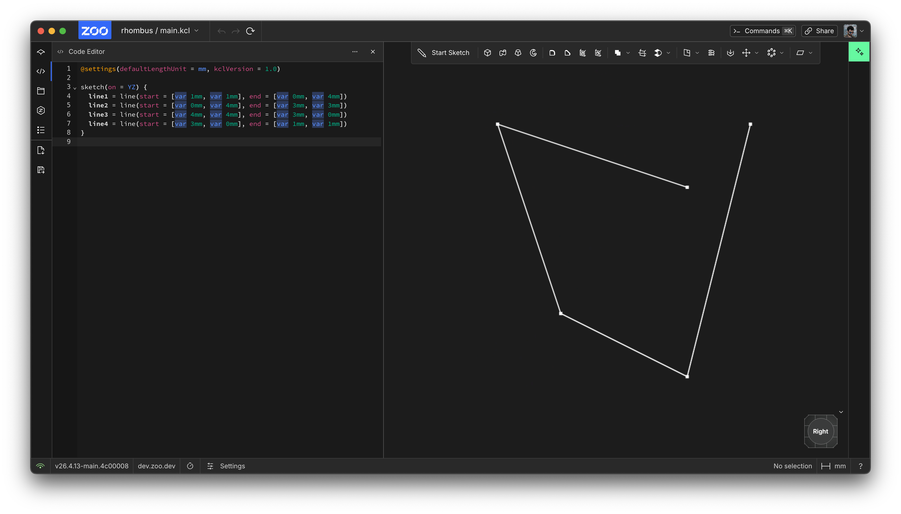
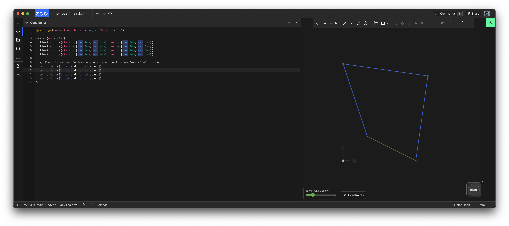
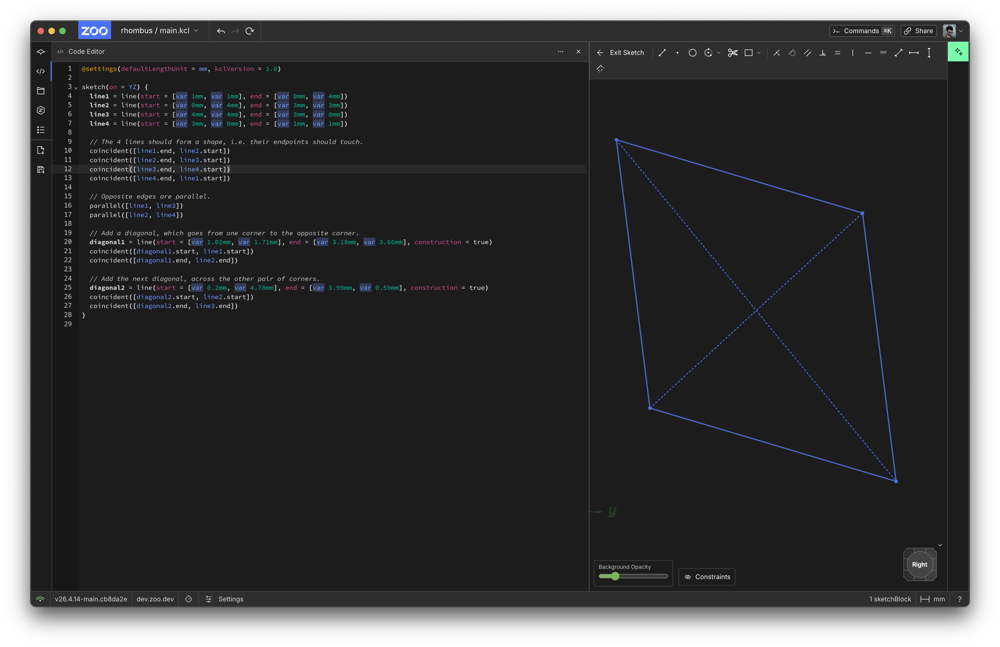
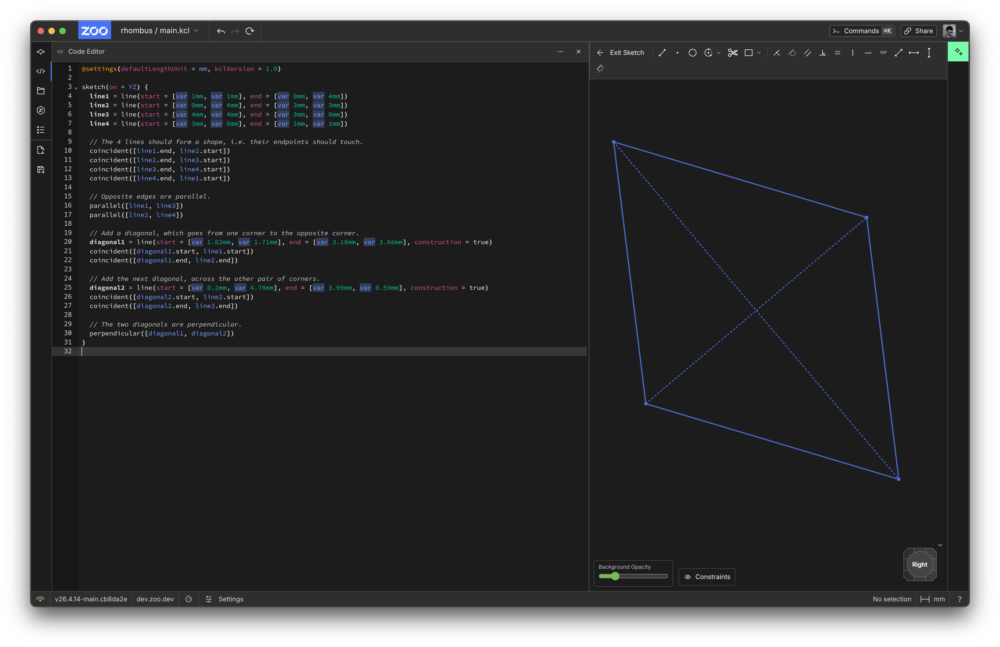

<!-- # Sketching 2D shapes -->

<!-- toc -->

Let's use KCL to sketch some basic 2D shapes. **Sketching** is a core workflow for mechanical engineers, designers, and hobbyists. You can either sketch _fixed geometry_, where you manually position your lines, points and curves, or you can use _unconstrained_ geometry, then _add constraints_ later to pin them down into a fixed position. We'll walk through both these options. Let's start with fixed geometry. Then we'll use constraints to think more like an engineer.

## Fixed geometry: your first triangle

Let's sketch a really simple triangle. We'll sketch a right-angled triangle, with side lengths 3 and 4.

Just copy this code into the KCL editor:


```kcl
@settings(defaultLengthUnit = mm, kclVersion = 1.0)

myTriangle = sketch(on = YZ) {
  line(start = [0, 0], end = [0, 3])
  line(start = [0, 3], end = [4, 3])
  line(start = [4, 3], end = [0, 0])
}
```

When you're done, use the Camera Cube in the corner and select the "Right" face. The camera should swivel around and face your triangle head-on. Your screen should look something like this:



Congratulations, you've sketched your first triangle! Rendering your first triangle is a [big deal in graphics programming](https://rampantgames.com/blog/?p=7745), and sketching your first triangle is a big deal in KCL. Let's break this code down line-by-line and see what it's actually doing. 

### 1: Set KCL settings

This step is optional, but it's good practice. KCL lets you set a few settings at the top of your file, with `@settings(...)`. Zoo Design Studio will usually set this line for you when you make a new file, and then you can change it later. In `@settings(defaultLengthUnit = mm, kclVersion = 1.0)`, we're choosing two settings:

 1. Set the default unit to millimeters. This means that when you write a point like `[4, 3]` it's treated as 4 millimeters and 3 millimeters. You could write them manually, via `[4mm, 3mm]` instead. But it's good to set these defaults, so everyone knows that `[4, 3]` means 4x3 millimeters, not inches or yards or meters. You could replace `mm` with `cm`, `m`, `in`, `ft`, or `yd` instead.
 2. Set the KCL version to `1.0`. This way, in the future, we could add new features in KCL 1.2 without affecting your old code.

### 2: Choose a plane

In KCL, there are six basic built-in planes you can use. There's XY, YZ, XZ, and negative versions of each (-XY, -YZ and -XZ). These negative planes are in the exact same place as their matching positive planes, but treat the Z axis (in other words, the axis considered "up") as the opposite direction.



You can use one of these standard planes, or define your own (we'll get to that later). Those six standard planes can be used just like normal variables you define, except they're pre-defined by KCL in its standard library. You can pass them into functions, like the [`sketch`] function. So, line 3, `sketch(on = YZ)` is where you choose a plane, and start sketching on it.

`sketch` takes one argument, the plane to sketch on. You can also start sketching on faces of your parts, or on custom planes, but we'll talk about that a bit later, in the chapter on [sketch on face].

### 3: Start a sketch block

The `sketch` keyword starts a _sketch block_. A sketch block contains geometry, and information about geometry. The sketch block's contents go inside curly braces. Our first sketch block will be very simple, with 3 lines. But you'll see more complex examples later.

### 4: Add geometry

Sketches contain geometry like lines, arcs, circles and points. In our example sketch, we added three straight lines, each with a start and end. These lines are created by the `line` function, which takes two parameters: a `start` and an `end`. We make a line like this: `line(start = [0, 0], end = [0, 3])`.

## Working with constraints

For simple geometry, like a single triangle, manually positioning the endpoints of lines works just fine. But when you're making more complex shapes, it's hard to choose the positions of every point. Mechanical engineers rarely work out every point's true location in 3D space. Instead, they start with a few pieces of information -- some initial guesses -- and then they add more requirements in, letting their CAD suite tweak the geometry to meet these requirements. In other words, they _constrain_ their initial guesses.

Let's start with a goal: sketching a rhombus. There are many ways to define a rhombus, but we'll use this definition: "a parallelogram in which the diagonals are perpendicular". Now, we could use a pen and paper to do some high-school geometry and work out where all 4 points of our rhombus go. But that's a waste of time. Let's just put some initial guesses in, and use KCL's built-in constraint solver to ensure we build a rhombus.

To start, we know our rhombus will have 4 lines. So let's put in some rough guesses.

```kcl
@settings(defaultLengthUnit = mm, kclVersion = 1.0)

sketch(on = YZ) {
  line1 = line(start = [var 1mm, var 1mm], end = [var 0mm, var 4mm])
  line2 = line(start = [var 0mm, var 4mm], end = [var 3mm, var 3mm])
  line3 = line(start = [var 4mm, var 4mm], end = [var 3mm, var 0mm])
  line4 = line(start = [var 3mm, var 0mm], end = [var 1mm, var 1mm])
}
```

This looks pretty similar to our earlier triangle example, with two big differences.

First, we're assigning each line to a _variable_. We've got 4 lines and 4 variables: `line1`, `line2`, `line3` and `line4`. This isn't strictly necessary yet -- each `line` call works just fine on its own, without being assigned to a variable, as you saw in the triangle example earlier. But assigning our geometry to variables lets us give the line a name. You can now refer to `line1` or `line2` later in your sketch block.

Secondly, we're using the _var_ keyword. This means each line's endpoint is no longer an exact location! If we used `start = [1mm, 1mm]`, that means the line has to start at _exactly_ the point (1, 1), no changes allowed. But if you write `start = [var 1mm, var 1mm]`, then KCL is allowed to reposition your line later. That's exactly what we want. (1, 1) is just a starting guess for where the corner of our rhombus will be. We'll let the computer do the hard work of calculating the exact geometry for us. So we tell KCL it's OK to reposition this point's X and Y axes, by using `var` with each one.

So far, our geometry looks like this:



That doesn't look very much like a rhombus. Let's add some _constraints_ -- some requirements we know. Firstly, we know that all 4 edges should share corners. In other words, line1 should end where line2 begins, line 2 should end where line 3 begins, and so on. Let's add some constraints.

```kcl
@settings(defaultLengthUnit = mm, kclVersion = 1.0)

sketch(on = YZ) {
  line1 = line(start = [var 1mm, var 1mm], end = [var 0mm, var 4mm])
  line2 = line(start = [var 0mm, var 4mm], end = [var 3mm, var 3mm])
  line3 = line(start = [var 4mm, var 4mm], end = [var 3mm, var 0mm])
  line4 = line(start = [var 3mm, var 0mm], end = [var 1mm, var 1mm])

  // The 4 lines should form a shape, i.e. their endpoints should touch.
  coincident([line1.end, line2.start])
  coincident([line2.end, line3.start])
  coincident([line3.end, line4.start])
  coincident([line4.end, line1.start])
}
```

There, now our 4 lines form a quadrilateral.



What else do we know about a rhombus? Well, we know the opposite lines have to be parallel. So let's tell KCL that line1 and line 3 are parallel, via `parallel([line1, line3])`. Same for line 2 and line 4.

```kcl
@settings(defaultLengthUnit = mm, kclVersion = 1.0)

sketch(on = YZ) {
  line1 = line(start = [var 1mm, var 1mm], end = [var 0mm, var 4mm])
  line2 = line(start = [var 0mm, var 4mm], end = [var 3mm, var 3mm])
  line3 = line(start = [var 4mm, var 4mm], end = [var 3mm, var 0mm])
  line4 = line(start = [var 3mm, var 0mm], end = [var 1mm, var 1mm])

  // The 4 lines should form a shape, i.e. their endpoints should touch.
  coincident([line1.end, line2.start])
  coincident([line2.end, line3.start])
  coincident([line3.end, line4.start])
  coincident([line4.end, line1.start])

  // Opposite edges are parallel.
  parallel([line1, line3])
  parallel([line2, line4])
}
```

Lastly, their internal diagonals should be perpendicular. Firstly, let's define its diagonals:

```kcl
// Add a diagonal, which goes from one corner to the opposite corner.
diagonal1 = line(start = [var 1.02mm, var 1.71mm], end = [var 3.18mm, var 3.66mm], construction = true)
coincident([diagonal1.start, line1.start])
coincident([diagonal1.end, line2.end])

// Add the next diagonal, across the other pair of corners.
diagonal2 = line(start = [var 0.2mm, var 4.78mm], end = [var 3.99mm, var 0.59mm], construction = true)
coincident([diagonal2.start, line2.start])
coincident([diagonal2.end, line3.end])
```

We've marked these two diagonal lines as _construction geometry_. That means we don't want them to show up in the final render of our shape. We're only adding these lines to our sketch block for constraining other, real geometry. But it shouldn't actually make a selectable edge elsewhere in our design. If you view the sketch in Zoo Design Studio, construction geometry is drawn with dashed lines. Real geometry uses normal, full lines.



Let's add a constraint on the diagonals:

```kcl
// The two diagonals are perpendicular.
perpendicular([diagonal1, diagonal2])
```

Now our shape is properly constrained to be a rhombus! Here's the final result:

```kcl
@settings(defaultLengthUnit = mm, kclVersion = 1.0)

starting = sketch(on = YZ) {
  line1 = line(start = [var 0.74mm, var 0.98mm], end = [var 0.13mm, var 3.79mm])
  line2 = line(start = [var 0.13mm, var 3.79mm], end = [var 2.98mm, var 3.33mm])
  line3 = line(start = [var 2.98mm, var 3.33mm], end = [var 3.58mm, var 0.51mm])
  line4 = line(start = [var 3.58mm, var 0.51mm], end = [var 0.74mm, var 0.98mm])

  // The 4 lines should form a shape, i.e. their endpoints should touch.
  coincident([line1.end, line2.start])
  coincident([line2.end, line3.start])
  coincident([line3.end, line4.start])
  coincident([line4.end, line1.start])

  // Opposite edges are parallel.
  parallel([line1, line3])
  parallel([line2, line4])

  // Add a diagonal, which goes from one corner to the opposite corner.
  diagonal1 = line(start = [var 0.74mm, var 0.98mm], end = [var 2.98mm, var 3.33mm], construction = true)
  coincident([diagonal1.start, line1.start])
  coincident([diagonal1.end, line2.end])

  // Add the next diagonal, across the other pair of corners.
  diagonal2 = line(start = [var 0.13mm, var 3.79mm], end = [var 3.58mm, var 0.51mm], construction = true)
  coincident([diagonal2.start, line2.start])
  coincident([diagonal2.end, line3.end])

  // The two diagonals are perpendicular.
  perpendicular([diagonal1, diagonal2])
}
```



Now when KCL runs this program, it'll take the initial guesses for each point (marked with `var`) and apply the constraints to figure out the final locations of all our geometry. This _really_ helps simplify complicated 2D shapes.

## Conclusion

We've learned how to use KCL to define 2D shapes:

 - Sketches are on some plane, and KCL includes standard planes XY, YZ and XZ (and their negative versions, which point the third axis down instead of up).
 - Start a sketch with a sketch block like `sketch(on = XY) { ... }`.
 - Sketches call functions like `line()` to make geometry.
 - Geometry can use fixed, exact points like `[2, 2]`, or they can vary the point's exact location later (like `[var 2, var 2]`).
 - You can assign geometry to variables, like `myLine = line(start = [2, 2], end = [3, 3])`.
 - Constraints reposition geometry, like `parallel([line1, line2])`.

Next, we'll look at how to build curved lines, like arcs and circles. We'll use new constraints on them to make more realistic shapes.

[`close`]: https://zoo.dev/docs/kcl-std/functions/std-sketch-close
[`line`]: https://zoo.dev/docs/kcl-std/functions/std-sketch-line
[`profileStart`]: https://zoo.dev/docs/kcl-std/functions/std-sketch-profileStart
[`startProfile`]: https://zoo.dev/docs/kcl-std/functions/std-sketch-startProfile
[`startSketchOn`]: https://zoo.dev/docs/kcl-std/functions/std-sketch-startSketchOn
[`xLine`]: https://zoo.dev/docs/kcl-std/functions/std-sketch-xLine
[`yLine`]: https://zoo.dev/docs/kcl-std/functions/std-sketch-yLine
[sketch on face]: sketch_on_face.html
