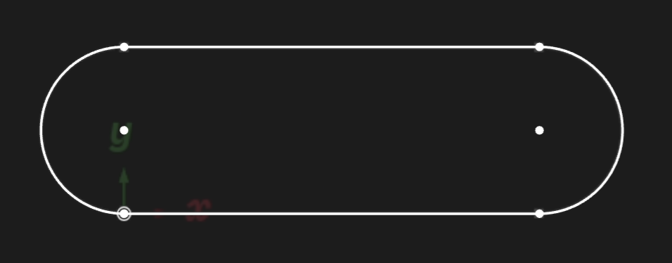
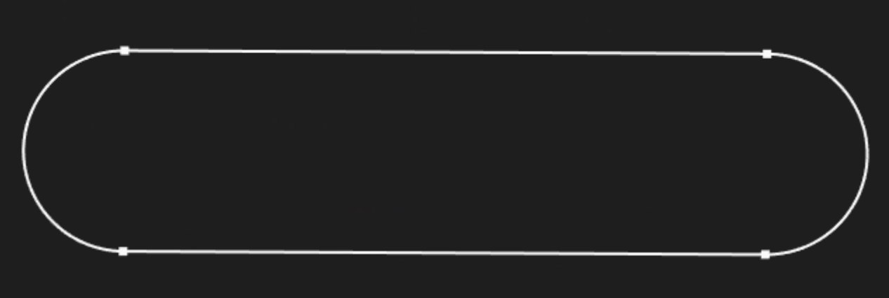

# Sketching curved lines

<!-- toc -->

In the previous chapter, we sketched basic shapes, like a triangle and a rhombus. In this chapter, we'll look at some more interesting kinds of sketches you can do, using other KCL standard library functions.

## Fixed arcs

Let's sketch a pill shape, like a rectangle but with rounded edges. We'll need arcs for this! Let's start with a basic sketch with fixed size and position. We'll need two straight lines and two circular arcs, made with the [`arc`] function.

```kcl
height = 4
width = 10
pill = sketch(on = XY) {
  bot = line(start = [0, 0], end = [width, 0])
  top = line(start = [0, height], end = [width, height])
  left = arc(start = [0, height], end = [0, 0], center = [0, height/2])
  right = arc(start = [width, 0], end = [width, height], center = [width, height/2])
}
```



In KCL, arcs are drawn counter-clockwise from their start point to their end point. This pill shape was very straightforward to code, but sketching it required me to use a pen and paper to figure out exactly where every point on the 2D plane was. The start and end of every arc and line had to be carefully calculated. Let's try letting KCL's constraint solver do the work for us instead. 

# Constrained arcs

We'll start again with two straight lines and two circular arcs, using some arbitrary values for each point's initial guess. I'm going to use Zoo Design Studio's UI to get these initial values, but you could guess them yourself, or do an approximate sketch on paper.

```kcl
pill = sketch(on = YZ) {
  line1 = line(start = [var -4.15mm, var 5.79mm], end = [var 0.72mm, var 5.85mm])
  line2 = line(start = [var 0.92mm, var 4.16mm], end = [var -4.11mm, var 4.19mm])
  arc1 = arc(start = [var -4.9mm, var 5mm], end = [var -4.53mm, var 4.2mm], center = [var -3.93mm, var 4.97mm])
  arc2 = arc(start = [var 2.07mm, var 4.39mm], end = [var 1.96mm, var 5.77mm], center = [var 1.28mm, var 5.02mm])
}
```

Our first job is to connect these 4 segments together:

```kcl
// Connect the 4 segments together
coincident([arc1.start, line1.start])
coincident([line1.end, arc2.end])
coincident([arc2.start, line2.start])
coincident([line2.end, arc1.end])
```

We know the pill should have [parallel] straight lines of [equal length], so we'll add those constraints:

```kcl
parallel([line1, line2])
equalLength([line1, line2])
```

We also want the two circular arcs to be the [same radius], and to meet [smoothly] at the straight lines. So we'll add:

```
equalRadius([arc2, arc1])
tangent([line1, arc1])
tangent([line1, arc2])
```

Great! Our final shape should look like this:



```kcl
pill = sketch(on = YZ) {
  line1 = line(start = [var -4.18mm, var 5.88mm], end = [var 1.34mm, var 5.85mm])
  line2 = line(start = [var 1.32mm, var 4.12mm], end = [var -4.19mm, var 4.15mm])
  arc1 = arc(start = [var -4.18mm, var 5.88mm], end = [var -4.19mm, var 4.15mm], center = [var -4.18mm, var 5.01mm])
  arc2 = arc(start = [var 1.32mm, var 4.12mm], end = [var 1.34mm, var 5.85mm], center = [var 1.33mm, var 4.99mm])
  coincident([arc1.start, line1.start])
  coincident([line1.end, arc2.end])
  coincident([arc2.start, line2.start])
  coincident([line2.end, arc1.end])
  parallel([line1, line2])
  equalLength([line1, line2])
  equalRadius([arc2, arc1])
  tangent([line1, arc1])
  tangent([line1, arc2])
}
```

This defines a nice pill shape. We could fix its position in 3D space by adding a `coincident` constraint between the start of a line, and the origin (referred to in KCL as a built-in constant, [`ORIGIN`]). Or we could constrain the distance from some point to the origin with the built-in [`distance`], [`verticalDistance`] and [`horizontalDistance`] functions.


## Circles

And lastly, let's look at the humble circle.

```kcl=basic_circle
myCircleSketch = sketch(on = XZ) {
  circle1 = circle(start = [var 0mm, var 4mm], center = [var 0mm, var 0mm])
}
```

<!-- KCL: name=basic_circle,skip3d=true,alt=A simple circle-->

> **NOTE**: This screenshot, like most screenshots that follow, is from an isometric perspective. It may look like an ellipse, but it's actually a circle. It would look like a circle from a heads-on angle.

<!-- TODO: Add attribute for camera angle -->

The [`circle`] function takes `center` and `start` arguments. The `start` argument is just any point along the circle's circumference. It's helpful in the Zoo point-and-click sketching UI, because it lets you easily snap constraints like a distance to it. The circle's radius is defined implicitly by the distance from `center` to `start` point. 

[`coincident`]: <https://zoo.dev/docs/kcl-std/functions/std-solver-coincident>
[`verticalDistance`]: <https://zoo.dev/docs/kcl-std/functions/std-solver-verticalDistance>
[`horizontalDistance`]: <https://zoo.dev/docs/kcl-std/functions/std-solver-horizontalDistance>
[`distance`]: <https://zoo.dev/docs/kcl-std/functions/std-solver-distance>
[`region`]: <https://zoo.dev/docs/kcl-std/functions/std-sketch-region>
[`circle`]: <https://zoo.dev/docs/kcl-std/functions/std-solver-circle>
[`arc`]: <https://zoo.dev/docs/kcl-std/functions/std-solver-arc>
[parallel]: <https://zoo.dev/docs/kcl-std/functions/std-solver-parallel>
[tangent]: <https://zoo.dev/docs/kcl-std/functions/std-solver-tangent>
[smoothly]: <https://zoo.dev/docs/kcl-std/functions/std-solver-tangent>
[same radius]: <https://zoo.dev/docs/kcl-std/functions/std-solver-equalRadius>
[equal length]: <https://zoo.dev/docs/kcl-std/functions/std-solver-equalLength>
[`ORIGIN`]: <https://zoo.dev/docs/kcl-std/consts/std-solver-ORIGIN>
