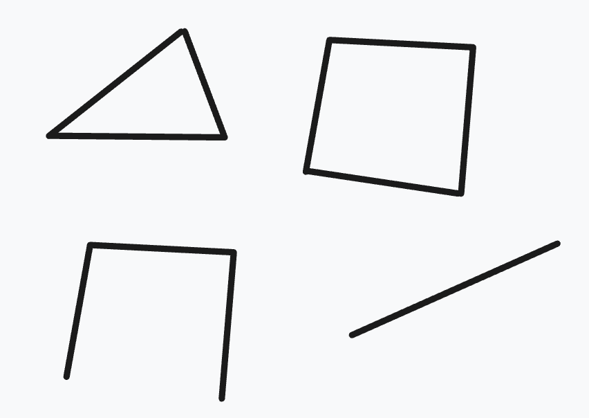

# Modeling 3D shapes
<!-- toc -->

Previous chapters covered designing 2D shapes. Now it's time to design 3D shapes!

3D shapes are usually made by adding depth to a 2D shape. There are two common ways engineers do this: by extruding or revolving 2D shapes into 3D. There's some less common ways too, including sweeps and lofts. In this chapter, we'll go through each of these! Let's get started with the most common method: extruding.

## Regions and Extrudes

Extruding takes a 2D shape and "pulls" it out of the plane, stretching it outwards into a third dimension. Let's start with the constrained pill shape we built in the previous chapter:

```kcl
pill = sketch(on = XZ) {
  line1 = line(start = [var -4.18mm, var 5.88mm], end = [var 1.34mm, var 5.85mm])
  line2 = line(start = [var 1.32mm, var 4.12mm], end = [var -4.19mm, var 4.15mm])
  arc1 = arc(start = [var -4.18mm, var 5.88mm], end = [var -4.19mm, var 4.15mm], center = [var -4.18mm, var 5.01mm])
  arc2 = arc(start = [var 1.32mm, var 4.12mm], end = [var 1.34mm, var 5.85mm], center = [var 1.33mm, var 4.99mm])
  coincident([arc1.start, line1.start])
  coincident([line1.end, arc2.end])
  coincident([arc2.start, line2.start])
  coincident([line2.end, arc1.end])
  parallel([line1, line2])
  equalLength([line1, line2])
  equalRadius([arc2, arc1])
  tangent([line1, arc1])
  tangent([line1, arc2])
}
```
It should look like this:


Now we're going to extrude it up into the third axis, making a 3D solid.

```kcl=pill_3d
pill = sketch(on = XZ) {
  line1 = line(start = [var -4.18mm, var 5.88mm], end = [var 1.34mm, var 5.85mm])
  line2 = line(start = [var 1.32mm, var 4.12mm], end = [var -4.19mm, var 4.15mm])
  arc1 = arc(start = [var -4.18mm, var 5.88mm], end = [var -4.19mm, var 4.15mm], center = [var -4.18mm, var 5.01mm])
  arc2 = arc(start = [var 1.32mm, var 4.12mm], end = [var 1.34mm, var 5.85mm], center = [var 1.33mm, var 4.99mm])
  coincident([arc1.start, line1.start])
  coincident([line1.end, arc2.end])
  coincident([arc2.start, line2.start])
  coincident([line2.end, arc1.end])
  parallel([line1, line2])
  equalLength([line1, line2])
  equalRadius([arc2, arc1])
  tangent([line1, arc1])
  tangent([line1, arc2])
}

// Add these lines!
region001 = region(segments = [pill.line1, pill.arc2])
extrude001 = extrude(region001, length = 1)
```

You should see something like this:

<!-- KCL: name=pill_3d,alt=2D pill extruded into 3D -->

> NOTE: If you're reading this book online, the above graphic should be an interactive 3D model. You can use your mouse (or touchpad) to spin the model, zoom in and out, pan around the 3D scene, etc.

We added two different functions to our program: [`region`] and [`extrude`]. They work together: `region` lets you pick out a closed region of 2D space from your sketch, and `extrude` transforms that region into a 3D solid.

### Picking a region

We need `region` because a sketch can contain lots of geometry. In the previous chapters, we used calls to [`line`] and [`arc`] to create closed shapes, like rhombuses and pills. But a sketch could contain multiple shapes, or free-floating lines that aren't part of any closed shape at all. Here's an example sketch:



This sketch contains two closed shapes (a triangle and a square) as well as other lines. So, when we use the `extrude` function, we have to say which closed region we want to extrude by naming segments that bound it.

#### Selecting by segments

Pass `segments` one or more segments that are part of the region you want. With multiple segments, `region` traces the first segment from its start point to the intersection with the second segment, then turns at each intersection until it returns to the first segment. Here we selected two connected segments:

```
region(segments = [pill.line1, pill.arc2])
```

If the boundary is a single closed segment (i.e., a circle) pass just that one segment:

```
region(segments = [circleSketch.circle1])
```

If the supplied segments could trace more than one boundary, use `direction` to choose clockwise or counterclockwise traversal and `intersectionIndex` to choose which intersection to follow. See the [`region`] reference for details.

### Extruding a region

Once you have a region of 2D space, you can turn that 2D space into 3D. We use the [`extrude`] function to take a region and say, "extrude it up into the 3rd dimension". `extrude` takes a distance, which is how far along the third axis to extrude. Every plane has a _normal_: the axis perpendicular to the plane. For the plane XZ, this is the Y axis. That normal is the direction that `extrude` uses to add depth to your 2D region, making it 3D.

### Advanced extrude options

 - `bidirectionalLength = <number>`: In addition to extruding up by `length`, also extrude _down_ by this much.
 - `symmetric = true`: Instead of extruding up by `length`, extrude up half the length, and down half the length. So, if you sketch on `XY` and then `extrude(length = 10)`, it'll extrude 10 from `Z=0` to `Z=10`. But if you use `extrude(length = 10, symmetric = true)` it'll go from `Z=-5` to `Z=5`.
 - `to = <target>`: Set a target (you can use a point, axis, plane, edge, face, sketch or solid), and this will extrude until it makes the solid reach the target (or as close as it can possibly get).
 - `twistAngle = 30deg`: While extruding, twist the sketch around its center. Or choose some other point to twist around, via `twistCenter`. Change the twist speed with `twistAngleStep`.

## Sweep

An extrude takes some 2D region and drags it up in a straight line along the normal axis. A _sweep_ is like an extrude, but the shape isn't just moved along a straight line: it could be moved along any path. Let's reuse our previous pill-shape example, but this time we'll sweep it instead of extruding it. First, we have to define a path that the sweep will take. Let's add one:

```kcl=path_for_sweep
pillSketch = sketch(on = YZ) {
  line1 = line(start = [var -4.18mm, var 5.88mm], end = [var 1.34mm, var 5.85mm])
  line2 = line(start = [var 1.32mm, var 4.12mm], end = [var -4.19mm, var 4.15mm])
  arc1 = arc(start = [var -4.18mm, var 5.88mm], end = [var -4.19mm, var 4.15mm], center = [var -4.18mm, var 5.01mm])
  arc2 = arc(start = [var 1.32mm, var 4.12mm], end = [var 1.34mm, var 5.85mm], center = [var 1.33mm, var 4.99mm])
  coincident([arc1.start, line1.start])
  coincident([line1.end, arc2.end])
  coincident([arc2.start, line2.start])
  coincident([line2.end, arc1.end])
  parallel([line1, line2])
  equalLength([line1, line2])
  equalRadius([arc2, arc1])
  tangent([line1, arc1])
  tangent([line1, arc2])
}
pillRegion = region(segments = [pillSketch.line1, pillSketch.arc2])

pathSketch = sketch(on = XZ) {
  line1 = line(start = [var 0mm, var 5.06mm], end = [var -5.02mm, var 4.93mm])
  vertical([line1.start, ORIGIN])
  arc1 = arc(start = [var -4.54mm, var 12.82mm], end = [var -5.02mm, var 4.93mm], center = [var -5.12mm, var 8.9mm])
  coincident([line1.end, arc1.end])
  tangent([line1, arc1])
}
```

<!-- KCL: name=path_for_sweep,skip3d=true,alt=A 2D pill shape and a path we're going to sweep it along-->

Our variable `pathSketch` has two lines (one straight line, one arc). Note that they _don't_ form a region! They form an _open profile_, i.e. a sequence of lines that doesn't close back in on itself.

Now we'll add the [`sweep`] call, like `sweep(pillRegion, path = [pathSketch.line1, pathSketch.arc1])`, which will drag our 2D pill sketch along the path we defined. We'll add it to the bottom of our code:

```kcl=path_for_sweep_complete
// This is the same in the previous example program:
pillSketch = sketch(on = YZ) {
  line1 = line(start = [var -4.18mm, var 5.88mm], end = [var 1.34mm, var 5.85mm])
  line2 = line(start = [var 1.32mm, var 4.12mm], end = [var -4.19mm, var 4.15mm])
  arc1 = arc(start = [var -4.18mm, var 5.88mm], end = [var -4.19mm, var 4.15mm], center = [var -4.18mm, var 5.01mm])
  arc2 = arc(start = [var 1.32mm, var 4.12mm], end = [var 1.34mm, var 5.85mm], center = [var 1.33mm, var 4.99mm])
  coincident([arc1.start, line1.start])
  coincident([line1.end, arc2.end])
  coincident([arc2.start, line2.start])
  coincident([line2.end, arc1.end])
  parallel([line1, line2])
  equalLength([line1, line2])
  equalRadius([arc2, arc1])
  tangent([line1, arc1])
  tangent([line1, arc2])
}
pillRegion = region(segments = [pillSketch.line1, pillSketch.arc2])

pathSketch = sketch(on = XZ) {
  line1 = line(start = [var 0mm, var 5.06mm], end = [var -5.02mm, var 4.93mm])
  vertical([line1.start, ORIGIN])
  arc1 = arc(start = [var -4.54mm, var 12.82mm], end = [var -5.02mm, var 4.93mm], center = [var -5.12mm, var 8.9mm])
  coincident([line1.end, arc1.end])
  tangent([line1, arc1])
}

// Add this new line of code to your program!
// Sweep the pill-shaped region along the given path.
sweep(pillRegion, path = [pathSketch.line1, pathSketch.arc1])
```

<!-- KCL: name=path_for_sweep_complete,alt=2D pill swept along path into 3D -->

Sweeps and extrudes are pretty similar! A sweep is basically a generalization of extrudes to allow extruding along more complicated paths. Or conversely, you could say an extrude is just a sweep whose path has to be a straight line along the normal to the plane. 

### Advanced sweep options

The [`sweep`] call has several other options you can set, listed in its documentation. Here are some optional parameters you can use to tweak the exact algorithm Zoo uses to compute the sweep:

 - `version = 1` or `version = 2` will change which Zoo sweep algorithm to use. The default, 0, means the Zoo engine will use whichever it thinks is best. 1 is the version we first launched Zoo with, and 2 is a new improved version that works better in many cases.
 - `translateProfileToPath = true` moves the profile onto the path before the sweep starts, instead of starting the sweep from wherever the profile already sits. Defaults to `false`, and requires `version = 2`.
 - `orientProfilePerpendicular = true` re-orients the profile so it's perpendicular to the path before the sweep starts. Defaults to `false`, and requires `version = 2`.
 - `sectional = true` will divide the swept path into several different stages, one per line in the path. The default is `sectional = false`.

**NOTE**: Older KCL used a `relativeTo` parameter (set to `sweep::TRAJECTORY` or `sweep::SKETCH_PLANE`) to control how the swept shape moved along the path. It's deprecated -- use `translateProfileToPath` and `orientProfilePerpendicular` instead.

If your sweep looks strange, try playing around with these options, or read the [`sweep`] docs page for more information.

## Revolve

Revolves are another common way to make a 3D shape. Let's start with a 2D shape, like a basic circle.

```kcl=circle
circleSketch = sketch(on = XZ) {
  // Sketch a circle whose center is [20, 0].
  circle1 = circle(start = [var 0mm, var 1mm], center = [var 0mm, var 0mm])
  fixed([circle1.center, [20, 0]])

  // Use construction geometry to set the circle's radius to 1mm.
  vertical([circle1.start, circle1.center])
  line1 = line(start = [var 0mm, var 0mm], end = [var 0mm, var 1mm], construction = true)
  coincident([line1.start, circle1.center])
  coincident([line1.end, circle1.start])
  distance([line1.start, line1.end]) == 1mm
}
```

<!-- KCL: name=circle,skip3d=true,alt=A 2D circle before revolving.-->

Note that we placed the circle at `[20, 0]`, i.e. 20 units away from the global origin.

The [`revolve`] function takes a shape and revolves it, by dragging it around an axis. Let's revolve our circle around the Y axis (which is perpendicular to XZ, the plane we're sketching on), to make a ring shape. Because the circle being revolved is 20 units away from the global origin, the ring produced by the revolve should have a radius of 20.

```kcl=donut
circleSketch = sketch(on = XZ) {
  // Sketch a circle whose center is [20, 0].
  circle1 = circle(start = [var 0mm, var 1mm], center = [var 0mm, var 0mm])
  fixed([circle1.center, [20, 0]])

  // Use construction geometry to set the circle's radius to 1mm.
  vertical([circle1.start, circle1.center])
  line1 = line(start = [var 0mm, var 0mm], end = [var 0mm, var 1mm], construction = true)
  coincident([line1.start, circle1.center])
  coincident([line1.end, circle1.start])
  distance([line1.start, line1.end]) == 1mm
}

// Pick the region inside the circle
region001 = region(segments = [circleSketch.circle1])

// Revolve it around the center of the scene
revolve001 = revolve(region001, axis = Y)
```

<!-- KCL: name=donut,alt=The circle has been revolved around an axis to make a donut -->

Beautiful. If we'd placed the original circle closer to the origin, the ring would be smaller.

[`revolve`] has an optional argument called `angle`. In the above example, we didn't provide it, so it defaulted to 360 degrees. But we can set it to 240 degrees, and get two thirds of a donut:

```kcl=donut240
// This part is the same as the previous example:
circleSketch = sketch(on = XZ) {
  circle1 = circle(start = [var 0mm, var 1mm], center = [var 0mm, var 0mm])
  fixed([circle1.center, [20, 0]])
  vertical([circle1.start, circle1.center])
  line1 = line(start = [var 0mm, var 0mm], end = [var 0mm, var 1mm], construction = true)
  coincident([line1.start, circle1.center])
  coincident([line1.end, circle1.start])
  distance([line1.start, line1.end]) == 1mm
}
region001 = region(segments = [circleSketch.circle1])

// Change the angle to 240deg
revolve001 = revolve(region001, angle = 240deg, axis = Y)
```

<!-- KCL: name=donut240,alt=The circle has been revolved partway around an axis to make a donut -->

### Spheres

You can make a sphere by revolving a semicircle its full 360 degrees. First, let's make a semicircle:

```kcl=semicircle
semiCircleSketch = sketch(on = XZ) {
  arc1 = arc(start = [var 1.81mm, var -2.03mm], end = [var -1.91mm, var 1.94mm], center = [var 0mm, var 0mm])
  coincident([arc1.center, ORIGIN])
  line1 = line(start = [var 0mm, var 1.74mm], end = [var 0mm, var 0mm])
  vertical([line1.start, ORIGIN])
  coincident([line1.end, arc1.center])
  line2 = line(start = [var 0mm, var 0mm], end = [var 0mm, var -1.92mm])
  coincident([line2.start, line1.end])
  vertical([line2.end, ORIGIN])
  equalLength([line1, line2])
  distance([line1.start, line1.end]) == 1.83mm
  coincident([line1.start, arc1.end])
  coincident([arc1.start, line2.end])
}
```

<!-- KCL: name=semicircle,skip3d=true,alt=Sketching a semicircle-->

Then we can revolve that semicircle 360 degrees to make a sphere:

```kcl=sphere
semiCircleSketch = sketch(on = XZ) {
  arc1 = arc(start = [var 1.81mm, var -2.03mm], end = [var -1.91mm, var 1.94mm], center = [var 0mm, var 0mm])
  coincident([arc1.center, ORIGIN])
  line1 = line(start = [var 0mm, var 1.74mm], end = [var 0mm, var 0mm])
  vertical([line1.start, ORIGIN])
  coincident([line1.end, arc1.center])
  line2 = line(start = [var 0mm, var 0mm], end = [var 0mm, var -1.92mm])
  coincident([line2.start, line1.end])
  vertical([line2.end, ORIGIN])
  equalLength([line1, line2])
  distance([line1.start, line1.end]) == 1.83mm
  coincident([line1.start, arc1.end])
  coincident([arc1.start, line2.end])
}

semiCircleRegion = region(segments = [semiCircleSketch.arc1, semiCircleSketch.line1])
revolve001 = revolve(semiCircleRegion, axis = Y)
```

<!-- KCL: name=sphere,skip3d=true,alt=Revolving a semicircle makes a sphere -->

Note that here, we omitted the `angle` argument from the `revolve` call because it defaults to 360 degrees.

## Lofts

All previous methods -- extrudes, sweeps, revolves -- took a single 2D shape and made a single 3D solid. Lofts are a little different -- they take _multiple_ 2D shapes and join them to make a single 3D shape. A [`loft`] interpolates between various sketches, creating a volume that smoothly blends from one shape into another. Let's see an example:

```kcl=loft_basic
// Sketch a square
square = sketch(on = XY) {
  line1 = line(start = [var 0mm, var -2mm], end = [var 2mm, var -2mm])
  line2 = line(start = [var 2mm, var -2mm], end = [var 2mm, var 0mm])
  line3 = line(start = [var 2mm, var 0mm], end = [var 0mm, var 0mm])
  line4 = line(start = [var 0mm, var 0mm], end = [var 0mm, var -2mm])
  coincident([line1.end, line2.start])
  coincident([line2.end, line3.start])
  coincident([line3.end, line4.start])
  coincident([line4.end, line1.start])
  parallel([line2, line4])
  parallel([line3, line1])
  perpendicular([line1, line2])
  horizontal(line3)
  equalLength([line1, line2, line3, line4])
  perpendicular([line4, line1])
  coincident([line4.start, [-5mm, 5mm]])
  distance([line3.start, line3.end]) == 10mm
}

// Sketch a circle, 10mm above the square.
circle = sketch(on = offsetPlane(XY, offset = 10mm)) {
  circle1 = circle(start = [var 0mm, var 1.5mm], center = [var 0mm, var 0mm])
  coincident([circle1.center, ORIGIN])
  vertical([circle1.start, circle1.center])
  distance([circle1.start, circle1.center]) == 1.5mm
}

// Pick out the right regions from each sketch.
squareRegion = region(segments = [square.line1, square.line2])
circleRegion = region(segments = [circle.circle1])

// Loft the square into the circle.
loft([squareRegion, circleRegion])
```

<!-- KCL: name=loft_basic,alt=Basic loft of a square into a circle-->

Note that we used the [`offsetPlane`] function to start the circle sketch above the XY plane. We'll cover offsetPlane more in the chapter on [planes]. The [`loft`] function has a few other advanced options you can set. One of these is `vDegree`, which affects how smoothly KCL interpolates between the shapes. Take a look at these two examples, which are identical except for vDegree. This example uses `vDegree = 1`:

```kcl=loft_vd1
// Sketch a square
square = sketch(on = XY) {
  line1 = line(start = [var 0mm, var -2mm], end = [var 2mm, var -2mm])
  line2 = line(start = [var 2mm, var -2mm], end = [var 2mm, var 0mm])
  line3 = line(start = [var 2mm, var 0mm], end = [var 0mm, var 0mm])
  line4 = line(start = [var 0mm, var 0mm], end = [var 0mm, var -2mm])
  coincident([line1.end, line2.start])
  coincident([line2.end, line3.start])
  coincident([line3.end, line4.start])
  coincident([line4.end, line1.start])
  parallel([line2, line4])
  parallel([line3, line1])
  perpendicular([line1, line2])
  horizontal(line3)
  equalLength([line1, line2, line3, line4])
  perpendicular([line4, line1])
  coincident([line4.start, [-5mm, 5mm]])
  distance([line3.start, line3.end]) == 10mm
}

// Sketch a circle, 10mm above the square.
circle = sketch(on = offsetPlane(XY, offset = 10mm)) {
  circle1 = circle(start = [var 0mm, var 1.5mm], center = [var 0mm, var 0mm])
  coincident([circle1.center, ORIGIN])
  vertical([circle1.start, circle1.center])
  distance([circle1.start, circle1.center]) == 1.5mm
}

// Another square, above the other shapes.
square2 = sketch(on = offsetPlane(XY, offset = 20mm)) {
  line1 = line(start = [var 0mm, var -2mm], end = [var 2mm, var -2mm])
  line2 = line(start = [var 2mm, var -2mm], end = [var 2mm, var 0mm])
  line3 = line(start = [var 2mm, var 0mm], end = [var 0mm, var 0mm])
  line4 = line(start = [var 0mm, var 0mm], end = [var 0mm, var -2mm])
  coincident([line1.end, line2.start])
  coincident([line2.end, line3.start])
  coincident([line3.end, line4.start])
  coincident([line4.end, line1.start])
  parallel([line2, line4])
  parallel([line3, line1])
  perpendicular([line1, line2])
  horizontal(line3)
  equalLength([line1, line2, line3, line4])
  perpendicular([line4, line1])
  coincident([line4.start, [-5mm, 5mm]])
  distance([line3.start, line3.end]) == 10mm
}

// Pick out the right regions from each sketch.
squareRegion = region(segments = [square.line1, square.line2])
circleRegion = region(segments = [circle.circle1])
squareRegion2 = region(segments = [square2.line1, square2.line2])

// Loft the square into the circle.
loftedSolid = loft([squareRegion, circleRegion, squareRegion2], vDegree = 1)
```

<!-- KCL: name=loft_vd1,alt=Loft with vDegree 1-->

The following loft is identical, but we set `vDegree = 2`. That's actually the default, so we don't need to set it, but for the sake of example we'll explicitly set it there.

<details><summary>Click here for the same KCL code, but using vDegree = 2</summary>

```kcl=loft_vd2
// Sketch a square
square = sketch(on = XY) {
  line1 = line(start = [var 0mm, var -2mm], end = [var 2mm, var -2mm])
  line2 = line(start = [var 2mm, var -2mm], end = [var 2mm, var 0mm])
  line3 = line(start = [var 2mm, var 0mm], end = [var 0mm, var 0mm])
  line4 = line(start = [var 0mm, var 0mm], end = [var 0mm, var -2mm])
  coincident([line1.end, line2.start])
  coincident([line2.end, line3.start])
  coincident([line3.end, line4.start])
  coincident([line4.end, line1.start])
  parallel([line2, line4])
  parallel([line3, line1])
  perpendicular([line1, line2])
  horizontal(line3)
  equalLength([line1, line2, line3, line4])
  perpendicular([line4, line1])
  coincident([line4.start, [-5mm, 5mm]])
  distance([line3.start, line3.end]) == 10mm
}

// Sketch a circle, 10mm above the square.
circle = sketch(on = offsetPlane(XY, offset = 10mm)) {
  circle1 = circle(start = [var 0mm, var 1.5mm], center = [var 0mm, var 0mm])
  coincident([circle1.center, ORIGIN])
  vertical([circle1.start, circle1.center])
  distance([circle1.start, circle1.center]) == 1.5mm
}

// Another square, above the other shapes.
square2 = sketch(on = offsetPlane(XY, offset = 20mm)) {
  line1 = line(start = [var 0mm, var -2mm], end = [var 2mm, var -2mm])
  line2 = line(start = [var 2mm, var -2mm], end = [var 2mm, var 0mm])
  line3 = line(start = [var 2mm, var 0mm], end = [var 0mm, var 0mm])
  line4 = line(start = [var 0mm, var 0mm], end = [var 0mm, var -2mm])
  coincident([line1.end, line2.start])
  coincident([line2.end, line3.start])
  coincident([line3.end, line4.start])
  coincident([line4.end, line1.start])
  parallel([line2, line4])
  parallel([line3, line1])
  perpendicular([line1, line2])
  horizontal(line3)
  equalLength([line1, line2, line3, line4])
  perpendicular([line4, line1])
  coincident([line4.start, [-5mm, 5mm]])
  distance([line3.start, line3.end]) == 10mm
}

// Pick out the right regions from each sketch.
squareRegion = region(segments = [square.line1, square.line2])
circleRegion = region(segments = [circle.circle1])
squareRegion2 = region(segments = [square2.line1, square2.line2])

// Loft the square into the circle.
// This time use vDegree = 2. This is the default, so you don't actually
// need to set it. We're setting it here for the sake of example.
loftedSolid = loft([squareRegion, circleRegion, squareRegion2], vDegree = 2)
```

</details>

<!-- KCL: name=loft_vd2,alt=Loft with vDegree 2-->

As you can see, the `vDegree` makes a big difference. You can view other options on the [`loft`] docs page.

[`extrude`]: https://zoo.dev/docs/kcl-std/functions/std-sketch-extrude
[`region`]: https://zoo.dev/docs/kcl-std/functions/std-sketch-region
[`loft`]: https://zoo.dev/docs/kcl-std/functions/std-sketch-loft
[`offsetPlane`]: https://zoo.dev/docs/kcl-std/functions/std-offsetPlane
[`revolve`]: https://zoo.dev/docs/kcl-std/functions/std-sketch-revolve
[sketch on face]: sketch_on_face.html
[`sweep`]: https://zoo.dev/docs/kcl-std/functions/std-sketch-sweep
[`line`]: https://zoo.dev/docs/kcl-std/functions/std-solver-line
[`arc`]: https://zoo.dev/docs/kcl-std/functions/std-solver-arc
[planes]: planes.md
