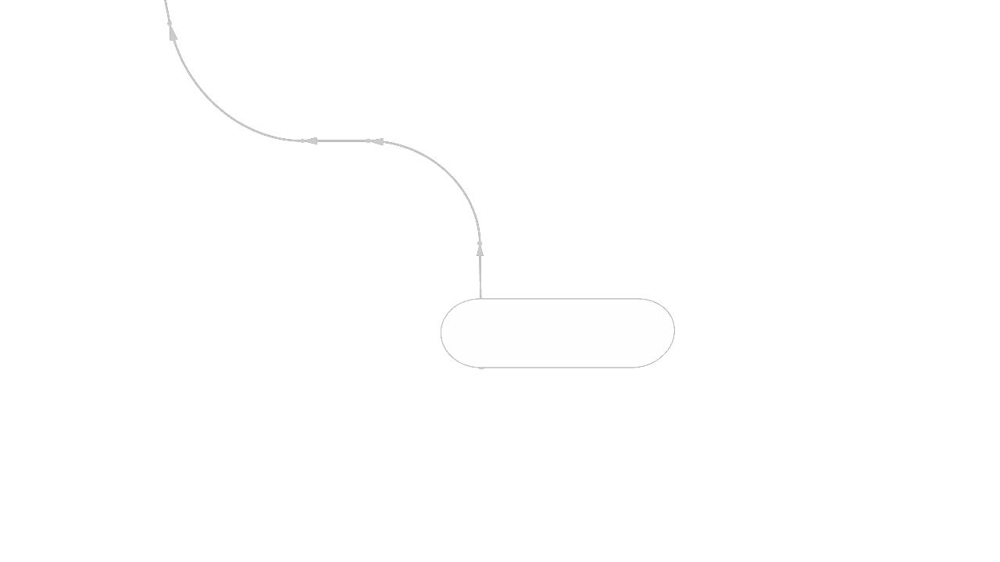
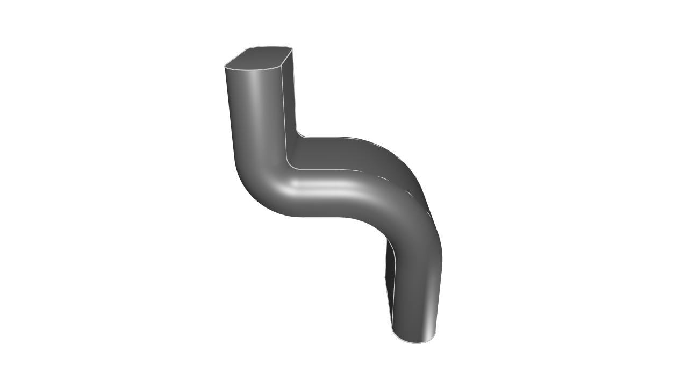
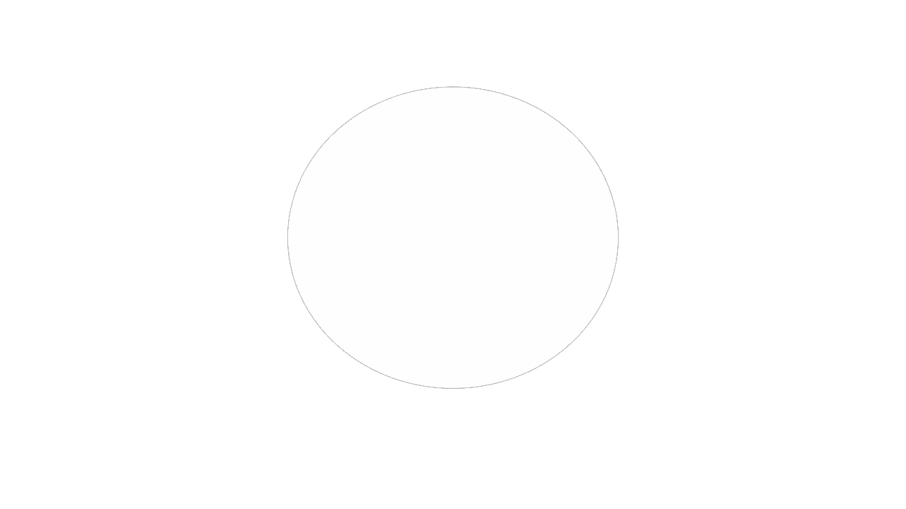
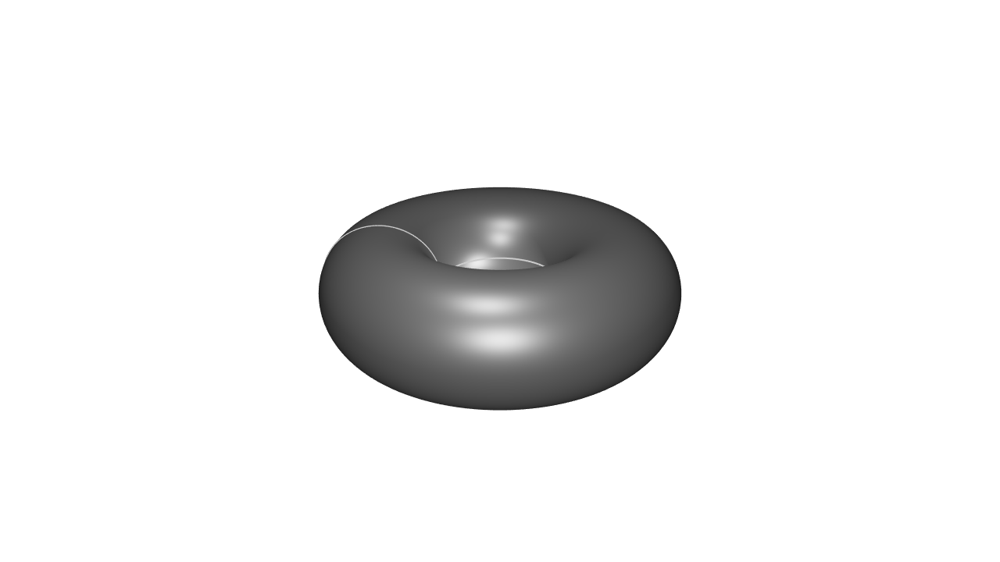
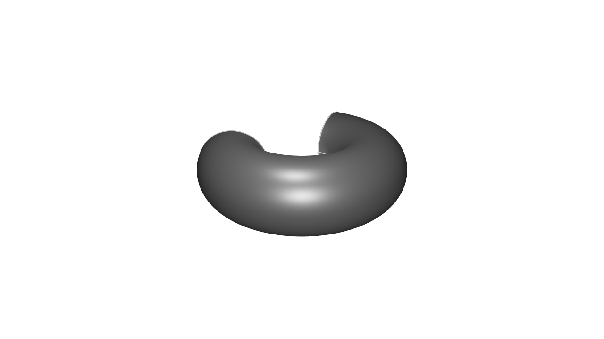
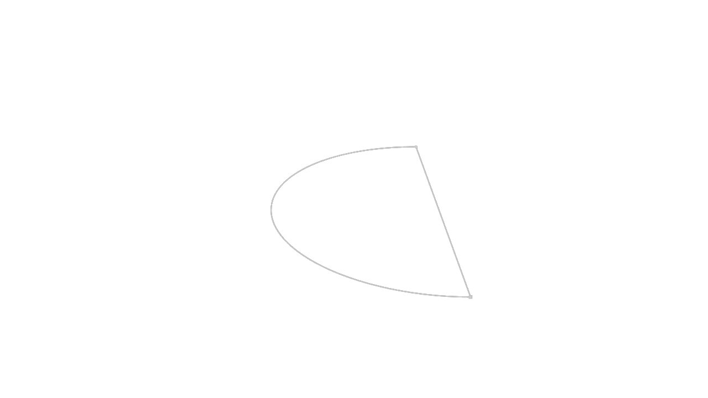
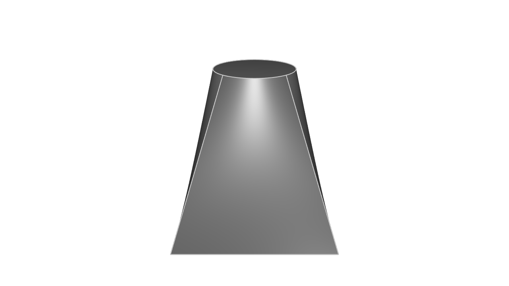
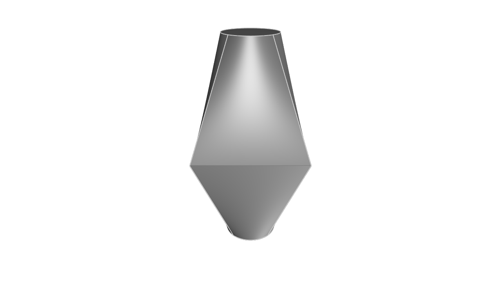
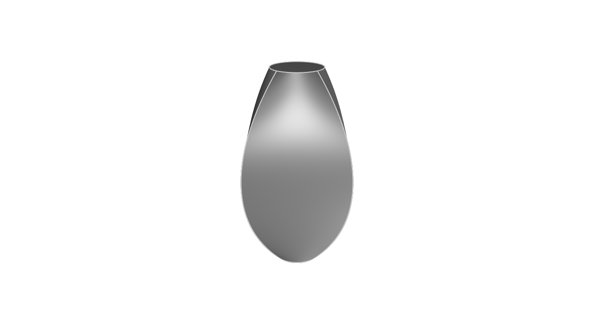

# Modeling 3D shapes
<!-- toc -->

Previous chapters covered designing 2D shapes. Now it's time to design 3D shapes!

3D shapes are usually made by adding depth to a 2D shape. There are two common ways engineers do this: by extruding or revolving 2D shapes into 3D. There's some less common ways too, including sweeps and lofts. In this chapter, we'll go through each of these! Let's get started with the most common method: extruding.

## Extrude

Extruding basically takes a 2D shape and pulls it up, stretching it upwards into the third dimension. Let's start with our existing 2D pill shape from the previous chapter:

```kcl
height = 4
width = 8
pill = startSketchOn(XZ)
  |> startProfile(at = [0, 0])
  |> xLine(length = width)
  |> tangentialArc(end = [0, height])
  |> xLine(length = -width)
  |> tangentialArc(endAbsolute = profileStart())
  |> close()
```
It should look like this:


{{#kcl_model path="pill_2d"}}

Now we're going to extrude it up into the third axis, making a 3D solid.

```kcl
height = 4
width = 8

// Add this line!
depth = 10

pill = startSketchOn(XZ)
  |> startProfile(at = [0, 0])
  |> xLine(length = width)
  |> tangentialArc(end = [0, height])
  |> xLine(length = -width)
  |> tangentialArc(endAbsolute = profileStart())
  |> close()

  // Add this line!
  // This line transforms the 2D sketch into a 3D solid.
  |> extrude(length = depth)
```

You should see something like this:


The [`extrude`] function takes a distance, which is how far along the third axis to extrude. Every plane has a _normal_, or an axis which is _tangent_ to the plane. For the plane XZ, this is the Y axis. This normal, or tangent, or axis perpendicular to the plane, is the direction that extrudes go along.

## Sweep

An extrude takes some 2D sketch and drags it up in a straight line along the normal axis. A _sweep_ is like an extrude, but the shape isn't just moved along a straight line: it could be moved along any path. Let's reuse our previous pill-shape example, but this time we'll sweep it instead of extruding it. First, we have to define a path that the sweep will take. Let's add one:

```kcl=path_for_sweep
height = 4
width = 8
depth = 10
pill = startSketchOn(XZ)
  |> startProfile(at = [0, 0])
  |> xLine(length = width)
  |> tangentialArc(end = [0, height])
  |> xLine(length = -width)
  |> tangentialArc(endAbsolute = profileStart())
  |> close()


// Create a path for the sweep.
sweepPath = startSketchOn(XZ)
  |> startProfile(at = [0.05, 0.05])
  |> line(end = [0, 7])
  |> tangentialArc(angle = 90, radius = 5)
  |> line(end = [-3, 0])
  |> tangentialArc(angle = -90, radius = 5)
  |> line(end = [0, 7])
```



Now we'll add the [`sweep`] call, like `swept = sweep(pill, path = sweepPath)`, which will drag our 2D pill sketch along the path we defined.

```kcl=swept_along_path
height = 4
width = 8
depth = 10
pill = startSketchOn(XZ)
  |> startProfile(at = [0, 0])
  |> xLine(length = width)
  |> tangentialArc(end = [0, height])
  |> xLine(length = -width)
  |> tangentialArc(endAbsolute = profileStart())
  |> close()


// Create a path for the sweep.
sweepPath = startSketchOn(XZ)
  |> startProfile(at = [0.05, 0.05])
  |> line(end = [0, 7])
  |> tangentialArc(angle = 90, radius = 5)
  |> line(end = [-3, 0])
  |> tangentialArc(angle = -90, radius = 5)
  |> line(end = [0, 7])

// Sweep the pill along the path
swept = sweep(pill, path = sweepPath)
```



The [`sweep`] call has several other options you can set, so read its docs page for more information.

## Revolve

Revolves are the other common way to make a 3D shape. Let's start with a 2D shape, like a basic circle.


```kcl=circle
startSketchOn(XZ)
  |> circle(center = [-200, 0], radius = 100)
```



The [`revolve`] function takes a shape and revolves it, dragging it around an axis. Let's revolve it around the Y axis (which is perpendicular to XZ, the plane we're sketching on), to make a donut shape.

```kcl=donut
startSketchOn(XZ)
  |> circle(center = [-200, 0], radius = 100)
  |> revolve(axis = Y)
```



There's an optional argument called `angle`. In the above example, we didn't provide it, so it defaulted to 360 degrees. But we can set it to 240 degrees, and get two thirds of a donut:

```kcl=donut240
startSketchOn(XZ)
  |> circle(center = [-200, 0], radius = 100)
  |> revolve(axis = Y, angle = 240)
```



### Spheres

You can make a sphere by revolving a semicircle its full 360 degrees. First, let's make a semicircle:

```kcl=semicircle
radius = 10
startSketchOn(XY)
  |> startProfile(at = [0, 0])
  |> yLine(length = radius * 2)
  |> arc(angleStart = 90, angleEnd = 270, radius = radius)
```



Then we can `close()` it and add a call to `revolve(axis = Y, angle = 360)` to revolve it into a sphere:

```kcl=sphere
radius = 10
startSketchOn(XY)
  |> startProfile(at = [0, 0])
  |> yLine(length = radius * 2)
  |> arc(angleStart = 90, angleEnd = 270, radius = radius)
  |> close()
  |> revolve(axis = Y, angle = 360)
```


## Lofts

All previous methods -- extrudes, sweeps, revolves -- took a single 2D shape and made a single 3D solid. Lofts are a little different -- they take _multiple_ 2D shapes and join them to make a single 3D shape. A loft interpolates between various sketches, creating a volume that smoothly blends from one shape into another. Let's see an example:

```kcl=loft_basic
// Sketch a square on the XY plane
squareSketch = startSketchOn(XY)
  |> startProfile(at = [-100, 200])
  |> line(end = [200, 0])
  |> line(end = [0, -200])
  |> line(end = [-200, 0])
  |> line(endAbsolute = [profileStartX(%), profileStartY(%)])
  |> close()

// Start a second sketch, 200 units above the XY plane.
circleSketch = startSketchOn(offsetPlane(XY, offset = 200))
  |> circle(center = [0, 100], radius = 50)

// Loft the square up and into the circle.
loft([squareSketch, circleSketch])
```



Note that we used the [`offsetPlane`] function to start the circle sketch 200 units above the XY plane. We'll cover offsetPlane more in the chapter on [sketch on face]. The [`loft`] function has a few other advanced options you can set. One of these is `vDegree`, which affects how smoothly KCL interpolates between the shapes. Take a look at these two examples, which are identical except for vDegree. This example uses `vDegree = 1`:

```kcl=loft_vd1
// Circle, 200 units below the XY plane.
circ0 = startSketchOn(offsetPlane(XY, offset = -200))
  |> circle(center = [0, 100], radius = 50)

// Square on the XY plane
squareSketch = startSketchOn(XY)
  |> startProfile(at = [-100, 200])
  |> line(end = [200, 0])
  |> line(end = [0, -200])
  |> line(end = [-200, 0])
  |> line(endAbsolute = [profileStartX(%), profileStartY(%)])
  |> close()

// Second circle, 200 units above the XY plane.
circ1 = startSketchOn(offsetPlane(XY, offset = 200))
  |> circle(center = [0, 100], radius = 50)

loftedSolid = loft([circ0, squareSketch, circ1], vDegree = 1)
```



The following loft is identical, but we set `vDegree = 2`. That's actually the default, so we don't need to set it, but for the sake of example we'll explicitly set it there.

```kcl=loft_vd2
// Circle, 200 units below the XY plane.
circ0 = startSketchOn(offsetPlane(XY, offset = -200))
  |> circle(center = [0, 100], radius = 50)

// Square on the XY plane
squareSketch = startSketchOn(XY)
  |> startProfile(at = [-100, 200])
  |> line(end = [200, 0])
  |> line(end = [0, -200])
  |> line(end = [-200, 0])
  |> line(endAbsolute = [profileStartX(%), profileStartY(%)])
  |> close()

// Second circle, 200 units above the XY plane.
circ1 = startSketchOn(offsetPlane(XY, offset = 200))
  |> circle(center = [0, 100], radius = 50)

loftedSolid = loft([circ0, squareSketch, circ1], vDegree = 2)
```



As you can see, the `vDegree` makes a big difference. You can view other options on the [`loft`] docs page.

[`extrude`]: https://zoo.dev/docs/kcl/extrude
[`loft`]: https://zoo.dev/docs/kcl/loft
[`offsetPlane`]: https://zoo.dev/docs/kcl-std/functions/std-offsetPlane
[`revolve`]: https://zoo.dev/docs/kcl/revolve
[sketch on face]: /sketch_on_face.html
[`sweep`]: https://zoo.dev/docs/kcl/sweep

