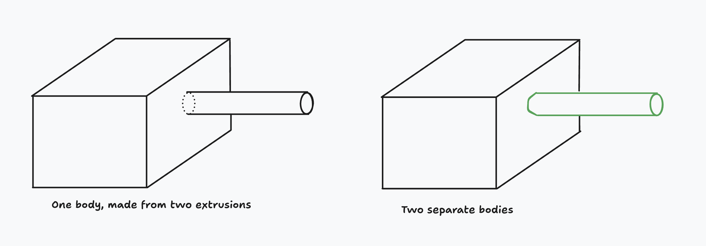

# Sketch on face

<!-- toc -->

In the previous chapter, we looked at how leveraging KCL tags lets you query your edges (to find their length, or angle with the previous edge), or apply an edge cut (like a fillet or chamfer). But you can also tag more than just edges! In this chapter, we'll learn how to tag faces, and how that lets you build more complicated 3D models.

## Side faces

Let's start with a simple example. First, we'll sketch and extrude a triangle.

```kcl=triangle_for_sketching
// Make a triangle
sketch001 = sketch(on = YZ) {
  line1 = line(start = [var 5.29mm, var -4.11mm], end = [var -4.31mm, var -4.11mm])
  line2 = line(start = [var -4.31mm, var -4.11mm], end = [var 0.49mm, var 5.14mm])
  coincident([line1.end, line2.start])
  line3 = line(start = [var 0.49mm, var 5.14mm], end = [var 5.29mm, var -4.11mm])
  coincident([line2.end, line3.start])
  coincident([line3.end, line1.start])
  equalLength([line2, line3])
  horizontal(line1)
}

// Extrude it
region001 = region(point = [0.49mm, -4.1075mm], sketch = sketch001)
extrude001 = extrude(region001, length = 1)
```

<!-- KCL: name=triangle_for_sketching,alt=An extruded triangle -->

When our triangle is extruded, its 3 edges create 3 new side faces, one for each original edge. I like to imagine extrusion like an invisible hand grabbing the flat sketch and pulling it upwards into the third dimension, slowly stretching each edge until they expand to become faces (surfaces). So, each new side face corresponds to an existing edge. And crucially, the faces are linked back to their parent edge. This means the face which grew out of the `line1` can be referred to via `extrude001.sketch.tags.line1`. We can use this to reference this face in our 3D model`.

Now, if we want to start a new sketch _on that face_, we can do so, with the `faceOf` function!

```kcl
myFace = faceOf(extrude001, face = region001.tags.line3)
sketch003 = sketch(on = myFace) {
  // We'll add lines to this sketch later.
}
```

In all the previous example sketches, we've sketched on a _plane_ (like XY or YZ). But now, we're passing a solid face (of our extruded triangle) instead. The solid has five faces (three side faces, a bottom, and a top), so we use `faceOf` to say which face in particular we want to sketch on. As we discussed above, the face can be referenced via `line1` (the line that it was extruded from). Now we can start sketching on this face, and even extrude that sketch too.


```kcl=triangle_with_cylinder_sketched
// Make a triangle
sketch001 = sketch(on = YZ) {
  line1 = line(start = [var 5.29mm, var -4.11mm], end = [var -4.31mm, var -4.11mm])
  line2 = line(start = [var -4.31mm, var -4.11mm], end = [var 0.49mm, var 5.14mm])
  coincident([line1.end, line2.start])
  line3 = line(start = [var 0.49mm, var 5.14mm], end = [var 5.29mm, var -4.11mm])
  coincident([line2.end, line3.start])
  coincident([line3.end, line1.start])
  equalLength([line2, line3])
  horizontal(line1)
}

// Extrude it
region001 = region(point = [0.49mm, -4.1075mm], sketch = sketch001)
extrude001 = extrude(region001, length = 1)

// Sketch on a face of the triangle.
face002 = faceOf(extrude001, face = region001.tags.line3)
sketch003 = sketch(on = face002) {
  line1 = line(start = [var -3.21mm, var 0mm], end = [var -2.7mm, var 0.65mm])
  horizontal([line1.start, ORIGIN])
  line2 = line(start = [var -2.7mm, var 0.65mm], end = [var -2.45mm, var 0.35mm])
  coincident([line1.end, line2.start])
  line3 = line(start = [var -2.45mm, var 0.35mm], end = [var -3.21mm, var 0mm])
  coincident([line2.end, line3.start])
  coincident([line3.end, line1.start])
}

// Extrude that sketch
region002 = region(point = [-2.9530332mm, 0.3234568mm], sketch = sketch003)
extrude002 = extrude(region002, length = 2)
```

<!-- KCL: name=triangle_with_cylinder_sketched,alt=Previous triangle now has another triangular prism sketched on one side face-->

Great! We extruded a solid (the triangle), and could sketch on one of its faces, even extruding that sketch.

>**Note**: When you sketch on a face, the sketch uses the _global coordinate system_. This means when you use 2D points in your sketches, they're relative to the overall global scene, and _not_ the face you're sketching on.

 Sketching on faces is a really common pattern when designing real-world objects. A LEGO brick is a good example -- first you'd sketch the rectangular brick, then you'd sketch on its top face, adding the little bumps on top. But wait a second. How would we specify the top face of the brick? That face isn't created from any particular edge. So we can't tag its `line` call and then reuse that tag for the face. What should we do?

## Standard faces

There's a simple solution to sketching on the top face. KCL has some built-in identifiers for the top and bottom face, [`END`] and [`START`]. We prefer the terms "start" and "end" to "top" and "bottom" because the latter depend on your camera angle, so they can be ambiguous. "Start" always refers to the original face from your 2D sketch. "End" always refers to the new face created at the end of the extrusion. Let's use them!

```kcl=triangle_top_and_bottom_sketches
// Same as previous example
sketch001 = sketch(on = YZ) {
  line1 = line(start = [var 5.29mm, var -4.11mm], end = [var -4.31mm, var -4.11mm])
  line2 = line(start = [var -4.31mm, var -4.11mm], end = [var 0.49mm, var 5.14mm])
  coincident([line1.end, line2.start])
  line3 = line(start = [var 0.49mm, var 5.14mm], end = [var 5.29mm, var -4.11mm])
  coincident([line2.end, line3.start])
  coincident([line3.end, line1.start])
  equalLength([line2, line3])
  horizontal(line1)
}
region001 = region(point = [0.49mm, -4.1075mm], sketch = sketch001)
extrude001 = extrude(region001, length = 1)

// Changed: We're using `face = END` here, which is a built-in
// identifier for the end of an extrusion.
face002 = faceOf(extrude001, face = END)
sketch003 = sketch(on = face002) {
  line1 = line(start = [var -0.3mm, var 0.76mm], end = [var -1.26mm, var -1.25mm])
  line2 = line(start = [var -1.26mm, var -1.25mm], end = [var 1.68mm, var -1.14mm])
  coincident([line1.end, line2.start])
  line3 = line(start = [var 1.68mm, var -1.14mm], end = [var -0.3mm, var 0.76mm])
  coincident([line2.end, line3.start])
  coincident([line3.end, line1.start])
}

// Extrude that sketch
region002 = region(point = [-0.7777441mm, -0.2460774mm], sketch = sketch003)
extrude002 = extrude(region002, length = 1)

```

<!-- KCL: name=triangle_top_and_bottom_sketches,alt=Solid with another triangle extruded from it-->

Great! These built-in face identifiers are always available on solids. We've learned how to sketch on the top, bottom and side faces. That covers all possible faces, right? Right? Not exactly! There's one more kind of face we haven't talked about yet. 

## Tags

When you [`chamfer`] an edge, it creates a new face, which can also be sketched on! But before we do, we've got to take a quick detour and talk about tags.

When Zoo launched, tags were used a lot. These days, you probably won't ever need to use tags very much, if at all, because they've been mostly replaced by variables. There are still a _few_ cases where you'll need tags, and sketching on a chamfered face is one of them. We're trying to phase them out, but we haven't finished that job yet.

So far, we've been able to refer to geometric features (like edges and faces) by using variables. But tags let you refer to geometry that isn't assigned to a variable. For example, take the chamfered face created by a `chamfer(myRegion)` call. When we call `mySolid = chamfer(myRegion, length = 1)` the variable `mySolid` refers to the _entire_ solid, including the chamfered face. How do we refer to some specific face, like the chamfered face? 

The solution: we use `mySolid = chamfer(myRegion, length = 1, tag = $myFace)`. That tags the face, so we can refer to it later as `myFace`. You can think of this like declaring a variable inside the function, when it executes. The `$` means you're declaring a tag. So, `$myFace` _declares_ a tag called `myFace`. If you later use just `myFace`, you're _referring_ to a tag that already exists.

Here's another example. Say you extrude a square into a cube. As discussed above, the top of the cube can be referred to with the standard face `END`. You can sketch on that top face via `sketch(on = faceOf(extrude001, face = END))`. Say you extrude a cylinder from the cube. How do you sketch on the top face of the cylinder? Does `END` refer to the cylinder, or the cube?

You can use `extrude(mySketch, tagEnd = $endOfCylinder)` to disambiguate these. Again, this defines a tag as part of the extrude, which refers to a particular face. Then you can use that tag later when you need to use the face.

Generally you won't need to use this method, but there are some niches where it's helpful.

## Sketch on chamfer

Now that we understand tags, we can use them to sketch on a chamfer! When you [`chamfer`] an edge, it creates a new face, which can also be sketched on! Consider this chamfered cube from the previous chapter:

```kcl=chamfered_cube
// Same as previous examples
width = 1
square = sketch(on = XY) {
  line1 = line(start = [width / 2, -width / 2], end = [width / 2, width / 2])
  line2 = line(start = [width / 2, width / 2], end = [-width / 2, width / 2])
  line3 = line(start = [-width / 2, width / 2], end = [-width / 2, -width / 2])
  line4 = line(start = [-width / 2, -width / 2], end = [width / 2, -width / 2])
}
regionCube = region(point = [0.4975mm, 0mm], sketch = square)
extrudeCube = extrude(regionCube, length = width)

// Apply a chamfer
chamferedCube = chamfer(
  extrudeCube,
  tags = [getOppositeEdge(extrudeCube.sketch.tags.line1)],
  length = 0.2,
)
```

<!-- KCL: name=chamfered_cube,alt=A chamfered cube-->

The chamfer produced a new face, and we can sketch on it too. Firstly, we add a tag to the [`chamfer`] call. Then we can use it in `faceOf`, and then we can sketch on it like any other  face.

```kcl=sketch_on_chamfered_cube
// Same as previous examples
width = 1
square = sketch(on = XY) {
  line1 = line(start = [width / 2, -width / 2], end = [width / 2, width / 2])
  line2 = line(start = [width / 2, width / 2], end = [-width / 2, width / 2])
  line3 = line(start = [-width / 2, width / 2], end = [-width / 2, -width / 2])
  line4 = line(start = [-width / 2, -width / 2], end = [width / 2, -width / 2])
}
regionCube = region(point = [0.4975mm, 0mm], sketch = square)
extrudeCube = extrude(regionCube, length = width)

// Apply a chamfer
chamferedCube = chamfer(
  extrudeCube,
  tags = [getOppositeEdge(extrudeCube.sketch.tags.line1)],
  length = 0.2,
  // Add a tag to the chamfered face:
  tag = $myChamferedFace,
)

// Refer back to the tagged face
faceToSketchOn = faceOf(extrudeCube, face = myChamferedFace)

// Start sketching on that face.
triangle = sketch(on = faceToSketchOn) {
  line1 = line(start = [var -0.37mm, var 0.33mm], end = [var -0.2mm, var 0.47mm])
  line2 = line(start = [var -0.2mm, var 0.47mm], end = [var 0.26mm, var 0.29mm])
  coincident([line1.end, line2.start])
  line3 = line(start = [var 0.26mm, var 0.29mm], end = [var -0.37mm, var 0.33mm])
  coincident([line2.end, line3.start])
  coincident([line3.end, line1.start])
}
region001 = region(point = [-0.2834107mm, 0.3980702mm], sketch = triangle)
extrude001 = extrude(region001, length = 0.4)
```

<!-- KCL: name=sketch_on_chamfered_cube,alt=Chamfered cube with cylinder sketched on the chamfered face-->

## Updating bodies, or creating new bodies?

When you extrude a sketch from a face, you could be trying to do one of two things:

 - Mutating the original body, by adding a new extrusion to it
 - Creating a totally new body, which just happens to be touching the previous body.

Here's an example. Say you extrude a square into a cube, and then you extrude a cylinder out of the cube. Should the cylinder be its own separate body? Or should there be a single body, with a cube volume and a cylindrical volume? Here's a visual:



By default, extruding a sketch which was sketched on a face will _merge_ the extrusion into the original body. In other words, the example on the left. But you can choose to make a _new_ body instead (the example on the right). You can choose between this by setting the _extrude method_.

 - Use `extrude(method = MERGE)` (the default) to update the original solid.
 - Use `extrude(method = NEW)` (an optional override) to create a new solid instead.

What's the practical difference between these? If you use `MERGE`, you've got one body. That means the single unified body will be translated, or rotated, or have its color changed, as one cohesive whole. With `NEW`, you've got two bodies, so you can reposition them independently, color them differently, etc. You'll learn how to move, rotate and recolor solids in the chapter on [transforms].

OK! Now we've learned how to sketch on all sorts of things:

 - Standard planes like XY or -XZ
 - Tagged faces of existing solids
 - Top or bottom faces of solids, using [`START`] and [`END`]
 - Chamfered faces cut out of solids, by tagging the [`chamfer`] call

There's one more thing we can sketch on: custom planes. Let's learn more about planes in the next chapter.

[`END`]: <https://zoo.dev/docs/kcl-std/consts/std-END>
[`START`]: <https://zoo.dev/docs/kcl-std/consts/std-START>
[`chamfer`]: https://zoo.dev/docs/kcl-std/functions/std-solid-chamfer
[`faceOf`]: https://zoo.dev/docs/kcl-std/functions/std-sketch-faceOf
[transforms]: transform_3d.md
