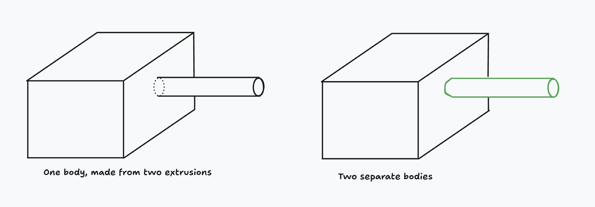

# Sketch on face

<!-- toc -->

Previously, we've seen how to sketch 2D shapes on planes, and extrude them into 3D solids. In this chapter, we'll make more complex 3D solids that combine multiple simpler solids! We do this by sketching on a face of an existing solid, extruding that sketch, and getting a more complex solid as a result.

To do this, we'll learn how to refer to faces of a solid. This is a core skill in KCL. Right now we're only going to use it to sketch on those faces. But in following chapters, we'll use references to faces for all kinds of interesting tricks.

## Side faces

Let's start with a simple example: referencing the side face of a solid. First, we'll sketch and extrude a triangle.

```kcl=triangle_for_sketching
@settings(defaultLengthUnit = mm, kclVersion = 2.0)

// Make a triangle
sketch001 = sketch(on = YZ) {
  line1 = line(start = [var 5.29mm, var -4.11mm], end = [var -4.31mm, var -4.11mm])
  line2 = line(start = [var -4.31mm, var -4.11mm], end = [var 0.49mm, var 5.14mm])
  coincident([line1.end, line2.start])
  line3 = line(start = [var 0.49mm, var 5.14mm], end = [var 5.29mm, var -4.11mm])
  coincident([line2.end, line3.start])
  coincident([line3.end, line1.start])
  equalLength([line2, line3])
  horizontal(line1)
}

// Extrude it
region001 = region(segments = [sketch001.line1, sketch001.line2])
extrude001 = extrude(region001, length = 1)
```

<!-- KCL: name=triangle_for_sketching,alt=An extruded triangle -->

When our triangle is extruded, its 3 edges create 3 new side faces, one for each original edge. The extrusion process also creates a top and bottom face, but we'll get to those faces later.

I like to imagine extrusion like an invisible hand grabbing the flat sketch and pulling it upwards into the third dimension, slowly stretching each edge until they expand to become faces (surfaces). So, each new side face corresponds to an existing line of the sketch. This isn't just an abstract explanation of geometry -- KCL actually tracks which line segment is the metaphorical "parent" of a side face. For example, the face which grew out of the `line3` can be referred to via `extrude001.sketch.tags.line3`. We can use this to reference this face in our 3D model.

Now, if we want to start a new sketch _on that face_, we can do so, with the [`faceOf`] function!

```kcl
myFace = faceOf(extrude001, face = extrude001.sketch.tags.line3)
sketch003 = sketch(on = myFace) {
  // We'll add lines to this sketch later.
}
```

(note: you could also do `face = region001.tags.line3`)

In all the previous example sketches, we've sketched on a _plane_ (like XY or YZ). But now, we're passing a solid face (of our extruded triangle) instead. The solid has five faces (three side faces, a bottom, and a top), so we use [`faceOf`] to say which face in particular we want to sketch on. As we discussed above, the face can be referenced via `line3` (the line that it was extruded from). Now we can start sketching on this face, and even extrude that sketch too.


```kcl=triangle_with_cylinder_sketched
@settings(defaultLengthUnit = mm, kclVersion = 2.0)

// Make a triangle
sketch001 = sketch(on = YZ) {
  line1 = line(start = [var 5.29mm, var -4.11mm], end = [var -4.31mm, var -4.11mm])
  line2 = line(start = [var -4.31mm, var -4.11mm], end = [var 0.49mm, var 5.14mm])
  coincident([line1.end, line2.start])
  line3 = line(start = [var 0.49mm, var 5.14mm], end = [var 5.29mm, var -4.11mm])
  coincident([line2.end, line3.start])
  coincident([line3.end, line1.start])
  equalLength([line2, line3])
  horizontal(line1)
}

// Extrude it
region001 = region(segments = [sketch001.line1, sketch001.line2])
extrude001 = extrude(region001, length = 1)

// Sketch on a face of the triangle.
face002 = faceOf(extrude001, face = region001.tags.line2)
sketch003 = sketch(on = face002) {
  line1 = line(start = [var -3.21mm, var 0mm], end = [var -2.7mm, var 0.65mm])
  horizontal([line1.start, ORIGIN])
  line2 = line(start = [var -2.7mm, var 0.65mm], end = [var -2.45mm, var 0.35mm])
  coincident([line1.end, line2.start])
  line3 = line(start = [var -2.45mm, var 0.35mm], end = [var -3.21mm, var 0mm])
  coincident([line2.end, line3.start])
  coincident([line3.end, line1.start])
}

// Extrude that sketch
region002 = region(segments = [sketch003.line1, sketch003.line2])
extrude002 = extrude(region002, length = 2)
```

<!-- KCL: name=triangle_with_cylinder_sketched,alt=Previous triangle now has another triangular prism sketched on one side face-->

Great! We extruded a solid (the triangle), and could sketch on one of its faces, even extruding that sketch.

>**Note**: When you sketch on a face, the sketch uses the _global coordinate system_. This means when you use 2D points in your sketches, they're relative to the overall global scene, and _not_ the face you're sketching on.

 Sketching on faces is a really common pattern when designing real-world objects. A LEGO brick is a good example -- first you'd sketch the rectangular brick, then you'd sketch on its top face, adding the little bumps on top. But wait a second. How would we specify the top face of the brick? That face isn't created from any particular line of the sketch. It's created by extruding the entire sketch's region, enclosed by four lines. Without a unique parent line like `line2`, we can't use `extrude001.sketch.tags.line2`. What should we do?

## Standard faces

There's a simple solution to sketching on the top face. KCL has some built-in identifiers for the top and bottom face, [`END`] and [`START`]. We prefer the terms "start" and "end" to "top" and "bottom" because the latter depend on your camera angle, so they can be ambiguous. "Start" always refers to the original face from your 2D sketch. "End" always refers to the new face created at the end of the extrusion. Let's use them!

```kcl=triangle_top_and_bottom_sketches
@settings(defaultLengthUnit = mm, kclVersion = 2.0)

// Same as previous example
sketch001 = sketch(on = YZ) {
  line1 = line(start = [var 5.29mm, var -4.11mm], end = [var -4.31mm, var -4.11mm])
  line2 = line(start = [var -4.31mm, var -4.11mm], end = [var 0.49mm, var 5.14mm])
  coincident([line1.end, line2.start])
  line3 = line(start = [var 0.49mm, var 5.14mm], end = [var 5.29mm, var -4.11mm])
  coincident([line2.end, line3.start])
  coincident([line3.end, line1.start])
  equalLength([line2, line3])
  horizontal(line1)
}
region001 = region(segments = [sketch001.line1, sketch001.line2])
extrude001 = extrude(region001, length = 1)

// Changed: We're using `face = END` here, which is a built-in
// identifier for the end of an extrusion.
face002 = faceOf(extrude001, face = END)
sketch003 = sketch(on = face002) {
  line1 = line(start = [var -0.3mm, var 0.76mm], end = [var -1.26mm, var -1.25mm])
  line2 = line(start = [var -1.26mm, var -1.25mm], end = [var 1.68mm, var -1.14mm])
  coincident([line1.end, line2.start])
  line3 = line(start = [var 1.68mm, var -1.14mm], end = [var -0.3mm, var 0.76mm])
  coincident([line2.end, line3.start])
  coincident([line3.end, line1.start])
}

// Extrude that sketch
region002 = region(segments = [sketch003.line1, sketch003.line2])
extrude002 = extrude(region002, length = 1)

```

<!-- KCL: name=triangle_top_and_bottom_sketches,alt=Solid with another triangle extruded from it-->

Great! These built-in face identifiers are always available on solids. We've learned how to sketch on the top, bottom and side faces. There's one more way to refer to a face: via a "tag". 

## Tags

The standard faces `START` and `END` work fine when you're dealing with a single solid. But they can get confusing when there are many solids. It's usually clear from context which solid's START or END you're referring to, but not always. If you need to refer to a specific model's START or END, and KCL can't tell which model you're talking about, you need to use tags.

When Zoo launched, tags were used a lot. These days, you probably won't need to use tags very much, if at all, because they've been mostly replaced by variables. We're trying to phase them out, but we haven't finished yet. There are still a _few_ cases where you'll need tags, and referring to a specific start/end face of a specific solid is one of them.

When you do an `extrude` call, you can optionally _tag_ the start or end face, like this:

```kcl
myBox = extrude(mySketch, length = 1, tagStart = $myBoxStart)
myButton = extrude(mySketch, length = 1, tagEnd = $buttonEnd)
```

These two examples add a new name for referring to the start or end faces of an extruded solid. You can still refer to them via `START` and `END`, but declaring new tags for a face gives you an unambiguous, readable name for it. 

You can think of a tag declaration (like `$myBoxStart`) as a special variable being declared inside the function, when it executes. The `$` means you're declaring a tag. So, `$myBoxStart` _declares_ a tag called `myBoxStart`. If you later use just `myBoxStart`, you're _referring_ to a tag that already exists.

Here's a full example. This KCL produces the exact same solid as the previous examples, but we're using `tagEnd = $frontOfTriangle` and then later sketching on `face = frontOfTriangle`, which can be clearer than just using `END` everywhere in a complex model.

```kcl=custom_tag_extrude
@settings(defaultLengthUnit = mm, kclVersion = 2.0)

// Same as previous example
sketch001 = sketch(on = YZ) {
  line1 = line(start = [var 5.29mm, var -4.11mm], end = [var -4.31mm, var -4.11mm])
  line2 = line(start = [var -4.31mm, var -4.11mm], end = [var 0.49mm, var 5.14mm])
  coincident([line1.end, line2.start])
  line3 = line(start = [var 0.49mm, var 5.14mm], end = [var 5.29mm, var -4.11mm])
  coincident([line2.end, line3.start])
  coincident([line3.end, line1.start])
  equalLength([line2, line3])
  horizontal(line1)
}
region001 = region(segments = [sketch001.line1, sketch001.line2])
extrude001 = extrude(region001, length = 1, tagEnd = $frontOfTriangle)

// Changed: We're using the tag we declared above,
// to identify exactly the right face.
face002 = faceOf(extrude001, face = frontOfTriangle)
sketch003 = sketch(on = face002) {
  line1 = line(start = [var -0.3mm, var 0.76mm], end = [var -1.26mm, var -1.25mm])
  line2 = line(start = [var -1.26mm, var -1.25mm], end = [var 1.68mm, var -1.14mm])
  coincident([line1.end, line2.start])
  line3 = line(start = [var 1.68mm, var -1.14mm], end = [var -0.3mm, var 0.76mm])
  coincident([line2.end, line3.start])
  coincident([line3.end, line1.start])
}

// Extrude that sketch
region002 = region(segments = [sketch003.line1, sketch003.line2])
extrude002 = extrude(region002, length = 1)

```

## Updating bodies, or creating new bodies?

When you extrude a sketch from a face, you could be trying to do one of two things:

 - Mutating the original body, by adding a new extrusion to it
 - Creating a totally new body, which just happens to be touching the previous body.

Here's an example. Say you extrude a square into a cube, and then you extrude a cylinder out of the cube. Should the cylinder be its own separate body? Or should there be a single body, with a cube volume and a cylindrical volume? Here's a visual:



By default, extruding a sketch which was sketched on a face will _merge_ the extrusion into the original body. In other words, the example on the left. But you can choose to make a _new_ body instead (the example on the right). You can choose between this by setting the _extrude method_.

 - Use `extrude(method = MERGE)` (the default) to update the original solid.
 - Use `extrude(method = NEW)` (an optional override) to create a new solid instead.

What's the practical difference between these? If you use `MERGE`, you've got one body. That means the single unified body will be translated, or rotated, or have its color changed, as one cohesive whole. With `NEW`, you've got two bodies, so you can reposition them independently, color them differently, etc. You'll learn how to move, rotate and recolor solids in the chapter on [transforms].

OK! Now we've learned how to sketch on all sorts of things:

 - Standard planes like XY or -XZ
 - Tagged faces of existing solids
 - Top or bottom faces of solids, using [`START`] and [`END`]
 - How to tag faces, like `tagStart = $myFace`

There's one more thing we can sketch on: custom planes. Let's learn more about planes in the next chapter.

[`END`]: <https://zoo.dev/docs/kcl-std/consts/std-END>
[`START`]: <https://zoo.dev/docs/kcl-std/consts/std-START>
[`chamfer`]: https://zoo.dev/docs/kcl-std/functions/std-solid-chamfer
[`faceOf`]: https://zoo.dev/docs/kcl-std/functions/std-sketch-faceOf
[transforms]: transform_3d.md
